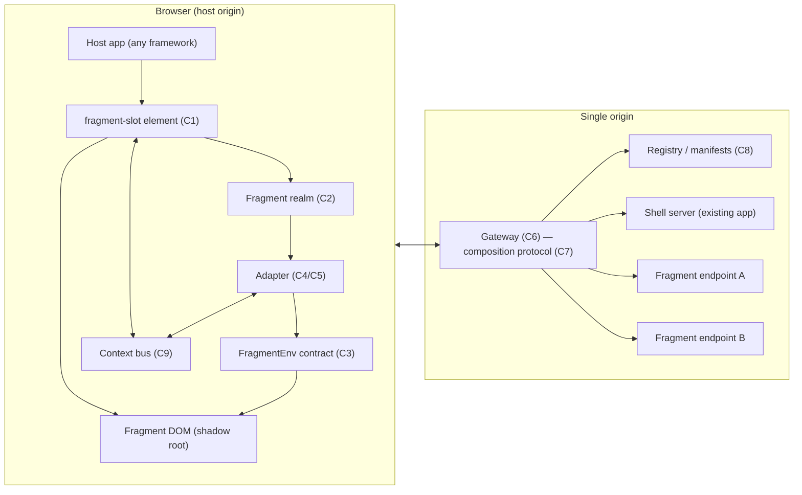
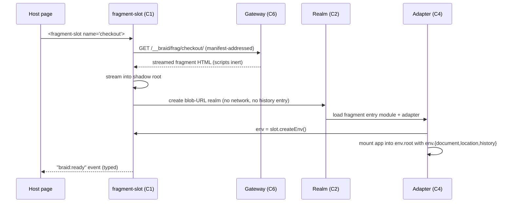
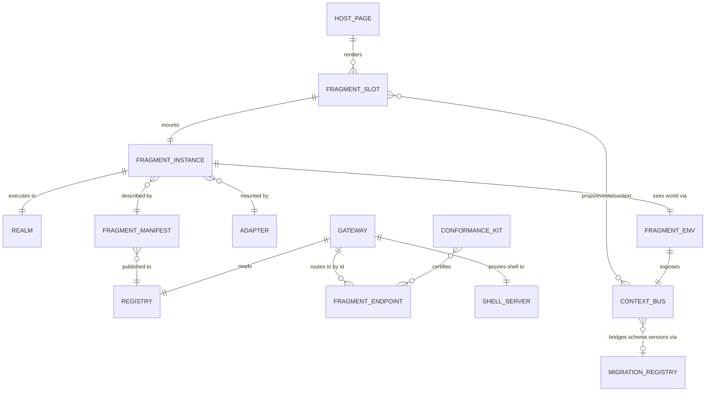
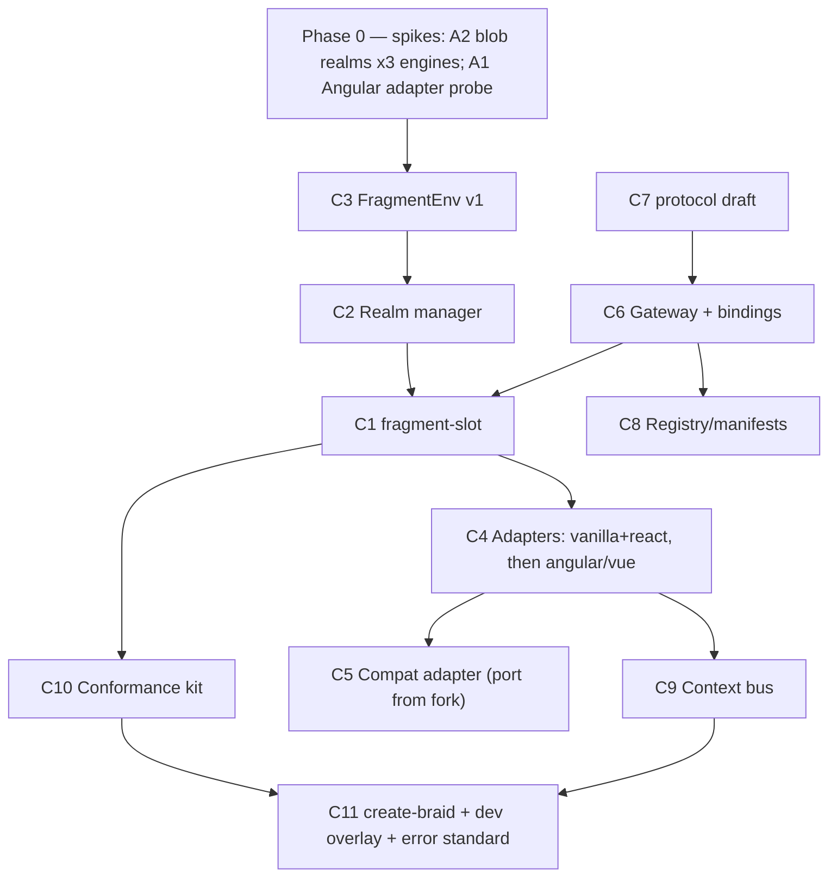

# Braid — founding architecture

- Status: draft for review. Name: **Braid** — independent strands composed into one strong cord, every strand keeping its identity, and unbraidable (incremental migration is reversible). Bare `braid` verified available on npm at drafting time; packages ship under the **SkewKit** org (`@skewkit/braid-*`).
- Positioning: Braid is the **composition layer of SkewKit**, whose thesis is the elimination of version-skew errors. Braid removes _dependency skew_ structurally (isolated realms and per-fragment import maps mean co-deployed apps cannot collide) and makes _contract skew_ visible and typed at the fragment boundary, where SkewKit's contract-migration machinery bridges it (see C9).
- Provenance: successor concept to [web-fragments](https://github.com/web-fragments/web-fragments) (MIT, Cloudflare-sponsored). Three of its subsystems were rebuilt and matrix-tested in the `Jefftopia/web-fragments` fork during Aug 2026 (document facade, strict host isolation, exact gateway routing); the empirical results from that work are cited throughout as evidence.
- Reading guide: every major decision carries a **🥊 self-review** block — the objection raised against the idea, and what survived. Components each carry an **ELI5**, an **API surface**, and a **monkey-patch disclosure**. If a section makes a claim without evidence, it appears in the Assumptions ledger with a verification plan.

---

## 1. The concept, distilled

Independent teams ship independently deployed frontend apps. At runtime they compose into one
cohesive page — one origin, one DOM, one accessibility tree — while each app keeps its own
JavaScript world, its own dependencies, and its own release train. Legacy monoliths can be
modernized one region of the page at a time.

Two inventions from web-fragments are kept as foundations:

1. **Split the JS context from the rendered DOM.** Fragment code runs in its own realm; its DOM
   lives in the host page inside a shadow root. Better than iframes (no layout/a11y/SEO walls),
   better than module federation (real isolation of globals and dependency graphs).
2. **The single-origin gateway.** A thin server component that composes shell + fragments,
   streams server-rendered fragment HTML into the page (piercing), and routes fragment traffic.

One doctrine from web-fragments is **rejected**: that the runtime should impersonate the entire
web platform so that arbitrary unmodified apps run as fragments. Eleven months of that project's
issue tracker — and our own facade/isolation work — show this is an unbounded, hand-maintained
emulation treadmill. Braid inverts it (§4, D1).

**Why Braid lives in SkewKit.** Independently deployed frontends are a version-skew generator:
every page composes artifacts built at different times against different dependency trees and
different contract versions. Braid attacks the two halves differently — and honestly:

- **Dependency skew is eliminated, not managed.** Realm-per-fragment isolation and per-realm
  import maps remove the shared surface on which dependency conflicts occur. Two fragments may
  ship different React majors, conflicting polyfills, zoned and zoneless Angular — there is
  nothing to collide.
- **Contract skew is surfaced, typed, and bridged — never silently absorbed.** Props, events,
  and shared context cross the fragment boundary as versioned, schema-carrying values (C9);
  protocol and contract versions are negotiated with named errors (C7, C3). Bridging a version
  gap — a fragment built against context schema v2 living on a page publishing v3 — is the job
  of SkewKit's bidirectional contract migrations, plugged in at the context bus.

The claim "Braid solves version skew" alone would be false advertising; isolation cannot fix a
mismatched payload. The layered claim — impossible where removable, typed and migratable where
not — is the SkewKit thesis applied to composition.

## 2. North star: developer experience budgets

A design this ambitious dies if it is fussy. These budgets are requirements, not aspirations;
the conformance kit (C10) enforces the measurable ones in CI.

| Budget                                      | Target                                                                        |
| ------------------------------------------- | ----------------------------------------------------------------------------- |
| Host a fragment                             | ≤ 5 lines (1 script tag, 1 element)                                           |
| Be a fragment (modern framework)            | 0 app-code changes + ≤ 5 lines of adapter wiring                              |
| Be a fragment (legacy app, compat mode)     | 0 app-code changes (config only)                                              |
| Local dev                                   | 1 command, all processes, < 30 s to interactive                               |
| Time-to-first-hello-world                   | < 10 minutes from `npm create @skewkit/braid`                                 |
| Error messages                              | every runtime error names the fragment, the failing stage, and the likely fix |
| Host page overhead when no fragment renders | zero — no patches, no listeners, no observers                                 |
| Upgrade safety                              | client and gateway are one package version; mismatch produces a named error   |

**🥊 self-review — "budgets are marketing, not architecture."** Objection: DX tables are wishes.
Response: each budget above eliminated at least one real design option during drafting. The
"host ≤ 5 lines" budget killed a build-plugin-based host integration; the "zero host overhead"
budget made host purity an invariant rather than a mode (D3); the "one command local dev" budget
forced the gateway to own dev-server proxying (C6) rather than documenting a reverse-proxy recipe.
The budgets are load-bearing; keep them in the doc.

## 3. System overview



Fragment boot, contract mode (happy path):



## 4. Foundational decisions

### D1 — Contract first; emulation is an adapter, not the foundation

The runtime hands each fragment explicit, honest objects — `env.root`, `env.document`,
`env.location`, `env.history`, `env.context` — and **framework adapters** feed them into
extension points frameworks already ship: Angular's `DOCUMENT`/`PlatformLocation` DI tokens and
`APP_BASE_HREF`; React's `createRoot(container)`; Vue's `app.mount(el)`. Apps that cannot be
told anything (the legacy monolith mid-migration — the actual paying customer of this concept)
run under the **compat adapter** (C5), which is the full web-fragments-style illusion, contained
and clearly labeled.

**🥊 self-review.** Objection 1: "adapters mean N surfaces to maintain instead of one."
Response: the N surfaces are small, versioned, and built on frameworks' _documented_ extension
points; the one surface they replace is the entire undocumented web platform. Our WebIDL audit
found 275 members on `Document` alone, most unclassified — that is what "one surface" really
means. Objection 2: "you lose the magic demo." Conceded, partially: the compat adapter preserves
"point at a URL, it renders" for exactly the audience that needs it, at a documented fidelity
level. Objection 3: "do modern apps even need the realm if they use the contract?" This one
nearly killed the realm for contract mode. It survives because realms also isolate _dependency
graphs_ (two React versions, conflicting polyfills, zone.js vs zoneless) and per-realm documents
give each fragment its own import map for free — which module-scoping alone cannot do.

### D2 — Realms are iframes; contract realms boot from blob URLs

The realm primitive remains a hidden same-origin iframe. It is the only browser primitive that
provides a synchronous, DOM-capable second JavaScript context (frameworks call `document.*` and
measure layout synchronously; workers force async — see the worker-dom post-mortem — and
ShadowRealm has no DOM at all).

The fresh decision: **contract-mode realms boot from a `blob:` URL** authored by the runtime
(same-origin by construction). No network round trip, no gateway stub, no server dependency for
client-side-only usage, and — because the realm never navigates — **zero interaction with the
joint session history**, eliminating the entire class of WebKit back/forward corruption we
debugged in the fork. The realm document carries the fragment's own `<base>` (asset resolution
via the exact namespace, D4) and its own import map.

Compat-mode realms (C5) still boot from a real `http:` URL inside the gateway namespace, because
only a real URL can make the _global_ `location`/`history` illusion truthful.

**🥊 self-review.** The first draft of this decision proposed blob realms for _all_ modes, with
`history.replaceState(routeUrl)` restoring the location illusion — the trick our fork uses. It
does not survive verification: `replaceState` may only change path/query/fragment relative to the
document's URL, and a `blob:`/`about:srcdoc` document cannot be rewritten to an `http:` URL —
the call throws. This is precisely _why_ web-fragments loads its iframe from a real URL. The
resolution: contract mode does not need the global illusion (apps read `env.location`), so blob
realms are safe there and forbidden in compat mode. A second objection — "iframes cost ~MBs per
realm" — is accepted as a real cost, and mitigated only by honesty: it is the price of true
isolation, documented, with a pooling experiment noted as an open question (§13).

### D3 — Host purity is an invariant, not a mode

Braid never mutates a host-page global or prototype, in any mode, ever. This is proven feasible:
the fork's strict host isolation passed the full behavior-parity matrix (4 configurations × 3
engines, 1,150 test executions) with a CI purity gate. Where web-fragments made purity an opt-in
(`hostIsolation: 'strict'`), Braid has no legacy switch to carry — the compat adapter achieves
its interception with fragment-boundary techniques (per-node prototype stamping, born-inert
scripts, boundary observer) that are already validated.

### D4 — Exact addressing is the only routing; patterns are sugar

All fragment traffic lives under a reserved namespace: `/__braid/frag/:fragmentId/*`. Routing is
by id — exact, mandatory, cacheable, nesting-safe. "Route patterns" exist only as developer
sugar that the gateway compiles into _which page URLs pierce which fragment_, never as the
mechanism for asset/data routing. This bakes in the fork's exact-routing result (which fixed
misrouted assets, `<base href>` handling, and made overlapping registrations safe) and removes
its backwards-compatibility warts (no header-based id fallback at all).

### D5 — The registry is data, not code

Fragments register via **manifest documents** the gateway loads (local file in dev, URL/KV in
prod). Deploying a fragment never redeploys the gateway. This is the control-plane story
enterprises actually need (web-fragments #262, never shipped).

### D6 — Two trust tiers, one component API

`<fragment-slot>` renders trusted fragments via the realm mechanism and untrusted third-party
fragments via a real sandboxed cross-origin iframe — same element, same props/events API,
degraded compositing. The "containerization" pitch becomes honest: trusted = namespace isolation,
untrusted = actual security boundary. `credentialless` is applied as a progressive enhancement
where supported (Chromium today).

### D7 — Zero forked dependencies

web-fragments ships on a forked HTMLRewriter wasm build and a forked writable-dom. Braid's
streaming needs are narrow and known (rename 3 elements, neutralize scripts/preload links,
inject at slots, interleave streams): a small, owned, spec-tested streaming rewriter lives in
the repo, with native `HTMLRewriter` used where the platform provides it. The streaming DOM
sink (writable-dom's role) is likewise owned, and written against the stamping boundary from
day one.

---

## 5. Entity model



| Entity             | One-liner                                                                                   |
| ------------------ | ------------------------------------------------------------------------------------------- |
| Fragment slot      | The custom element a host renders; owns lifecycle, shadow root, trust tier                  |
| Fragment instance  | One mounted occurrence of a fragment (a slot may remount; ids are per-instance)             |
| Realm              | The isolated JS context (blob iframe / http iframe / sandboxed iframe by tier+mode)         |
| FragmentEnv        | The contract object graph a fragment sees instead of patched globals                        |
| Adapter            | Framework-specific glue mapping FragmentEnv into the framework's extension points           |
| Manifest           | Versioned JSON describing a fragment: id, endpoint, entry, adapter, modes, contract version |
| Registry           | The collection of manifests the gateway serves routing from (file/URL/KV)                   |
| Gateway            | Origin-front middleware: namespace routing, piercing, shell proxying                        |
| Context bus        | Typed props-in/events-out/shared-context channel between host and fragments                 |
| Migration registry | SkewKit's contract-migration store; the bus consults it to bridge schema-version gaps       |
| Conformance kit    | Differential test runner certifying a fragment behaves as it does standalone                |

---

## 6. Components

### C1 — `<fragment-slot>` (host runtime)

**ELI5.** A picture frame you hang on your page. You tell it which painting you want by name;
it fetches the painting, hangs it inside its own glass (shadow root), and hands you a phone line
to talk to the artist. Taking the frame down cleans up everything.

**API surface.**

```html
<script type="module" src="/__braid/client.js"></script>
<fragment-slot name="checkout" trust="trusted" props='{"cartId":"abc"}'></fragment-slot>
```

```ts
interface FragmentSlotElement extends HTMLElement {
	name: string; // fragment id in the registry
	trust: 'trusted' | 'untrusted'; // tier (D6); default 'trusted'
	props: Record<string, unknown>; // serialized to the instance, reactive
	readonly state: 'idle' | 'loading' | 'ready' | 'error';
	readonly instance: FragmentInstanceHandle | null;
	reload(): Promise<void>;
}
// events: 'braid:ready' | 'braid:error' (typed detail incl. stage + fix hint) | 'braid:event' (fragment→host)
```

Framework wrappers (`@skewkit/braid-react`, `@skewkit/braid-angular`, `@skewkit/braid-vue`) are thin typed shims over the
element — a component per framework so hosts get prop typing and event handlers idiomatically.

**Monkey patches: none.** The slot uses only its own shadow root, its own elements, and
constructable stylesheets. (Bold claim given history; enforced by the purity gate in CI.)

**🥊 self-review.** Objection: web-fragments needed _two_ elements (`web-fragment` +
`web-fragment-host`) to survive piercing adoption and portaling — is one element naive? Partly.
The second element exists so pierced server-rendered content can be adopted across parse-time vs
upgrade-time boundaries. Resolution: keep the internal second element (`<braid-content>`) as an
implementation detail that never appears in docs or user markup; the public API is one element.
DevEx rule: internals may be complex, the visible surface may not.

### C2 — Realm manager

**ELI5.** Every fragment gets its own soundproof practice room (a hidden iframe). The band plays
in the practice room, but the audience sees them on the main stage (the shadow root). Modern
bands get a windowless room built instantly on-site (blob URL); tribute bands that insist the
room must look exactly like a real venue get one with a street address (http URL, compat mode).

**API surface** (internal to the runtime; not user-facing):

```ts
interface RealmManager {
	create(kind: 'contract-blob' | 'compat-http' | 'sandbox', init: RealmInit): Promise<RealmHandle>;
}
interface RealmHandle {
	readonly window: Window; // same-origin kinds only
	evaluate(entryUrl: string): Promise<void>; // module execution in-realm
	dispose(): void; // teardown incl. listener/observer cleanup
}
```

Realm properties by kind:

| Kind          | URL               | History involvement                                 | Used by                 |
| ------------- | ----------------- | --------------------------------------------------- | ----------------------- |
| contract-blob | `blob:`           | none, ever                                          | contract-mode fragments |
| compat-http   | `/__braid/frag/…` | initial load only (replaceState to route URL after) | compat adapter (C5)     |
| sandbox       | third-party URL   | browser-managed                                     | untrusted tier          |

**Monkey patches: none in contract-blob kind.** The realm document is authored by us; nothing
needs patching because nothing pretends. Compat-http realms carry the C5 patch ledger.

**🥊 self-review.** Objection: "blob realms will break framework code that reads
`document.baseURI` or constructs URLs from `location`." True — _in the realm's globals_. But
contract-mode code receives `env.location`/`env.document`; realm globals are explicitly out of
contract, and the conformance kit flags fragments that reach for them (a lint-like signal in dev:
the realm's `location` getter can warn once, realm-side only — a permitted patch since the realm
is wholly ours). Second objection: teardown — web-fragments leaks styles and relies on the
deprecated `unload` event. C2 owns disposal: `AbortController` for every listener, observer
disconnects, and `pagehide`-based lifecycles from day one.

### C3 — `FragmentEnv` (the contract)

**ELI5.** Instead of tricking the app into thinking it owns the whole browser, we hand it a
small, honest toolbox labeled "your document, your address bar, your root element." Apps that
use the toolbox work everywhere the toolbox works — no tricks to go stale.

**API surface** (the heart of the project; versioned like a wire protocol):

```ts
interface FragmentEnv {
	readonly contractVersion: '1.x';
	readonly root: HTMLElement; // mount point inside the shadow root
	readonly document: EnvDocument; // head ops, title, styles, activeElement — scoped
	readonly location: EnvLocation; // fragment's logical URL (bound or standalone)
	readonly history: EnvHistory; // push/replace/back; bound mode syncs host
	readonly context: EnvContext; // C9: get('auth'), subscribe('locale', cb)
	readonly props: Readonly<Record<string, unknown>>; // + onPropsChanged(cb)
	emit(type: string, detail?: unknown): void; // fragment → host, typed via manifest
	readonly signal: AbortSignal; // fires on unmount — wire everything to it
}
```

Design rules: every member is a real object with a stable identity (no getters that change
shape), every mutation path is explicit, and _nothing_ on `FragmentEnv` requires the realm — the
same contract can later be satisfied by other isolation backends (an eventual worker mode for
compute fragments would implement a subset, declared via `contractVersion` capability flags).

**Monkey patches: none.** This is the point of the component.

**🥊 self-review.** Objection: "this is just another custom micro-frontend SDK — the exact thing
web-fragments' framework-agnosticism avoided; now every fragment depends on `@skewkit/braid-env`."
This is the strongest objection in the document. Three-part response: (a) fragments do _not_
import the SDK — the adapter receives `env` as an argument at mount; app code stays clean, and
the dependency lives in 5 lines of wiring; (b) the compat adapter exists precisely so zero-touch
remains possible; (c) the counterfactual is not "agnosticism," it is _undocumented emulation
that breaks by browser release_ — agnosticism was never actually delivered upstream (see: Next.js
#290, Angular #272 open for a year+). Verdict: survives, but the doc must always show the
adapter-wiring version of "hello world" to prove how small the ask is.

### C4 — Adapter SDK + first-party adapters

**ELI5.** A wall plug converter. Angular, React, and Vue each have a socket the framework
company installed on purpose (their DI/mount APIs); the adapter is the 20-line converter that
plugs the Braid toolbox into that socket.

**API surface.**

```ts
// what fragment authors write (React example — the whole file):
import { defineFragment } from '@skewkit/braid-react';
import { App } from './App';
export default defineFragment(App); // props flow in as React props; env via useFragmentEnv()

// Angular example:
export default defineFragment(AppComponent, {
	providers: (env) => [
		{ provide: DOCUMENT, useValue: env.document },
		{ provide: APP_BASE_HREF, useValue: env.location.basePath },
	],
});

// adapter authors implement:
interface BraidAdapter {
	mount(env: FragmentEnv, entry: unknown): Promise<void> | void; // teardown via env.signal
}
```

First-party at launch: `react`, `angular`, `vue`, `vanilla`, `compat` (C5). Community adapters
are a explicit goal; the adapter interface is 1 function + the env contract.

**Monkey patches: none** in react/angular/vue/vanilla adapters. If an adapter cannot be written
without patching realm globals, that framework routes to compat mode instead — a bright-line rule.

**🥊 self-review.** Objection: "Angular's `DOCUMENT` token doesn't cover everything Angular
touches — router, `Title`, `Meta`, animations read the real document." Verified partially true:
Angular's abstractions cover the large majority (`DOCUMENT` flows into `Title`/`Meta`/renderer),
but some third-party Angular libraries reach for `document` directly. Mitigation: the adapter
docs carry a compatibility table per framework _feature_ (not per app), and the conformance kit
(C10) tells a team in minutes whether their specific app needs compat mode. The claim to verify
in Phase 1 with a real app is bulletin-app itself (Angular 21, zoneless) — listed in Assumptions.

### C5 — Compat adapter (the emulation layer, contained)

**ELI5.** For old apps that can't learn the toolbox, we build a movie set that looks exactly like
a whole browser. Movie sets are expensive and occasionally a wall falls over — so we put the set
inside one clearly marked soundstage, list every fake wall on a sign at the door, and alarm
every wall so a wobble is reported before a collapse.

**Composition** — all previously validated in the fork, now scoped to this adapter only:

- Document proxy facade with the generated WebIDL audit manifest (loud diagnostics for
  unclassified API use);
- boundary stamping + born-inert scripts + shadow-root observer (correctness/latency two-tier);
- http-URL realm within the gateway namespace, `<base>`-driven asset resolution, replaceState
  location illusion;
- window-side patch set (constructors' `hasInstance`, observers, sizing, history proxy), ported
  as-is and ledgered.

**API surface.**

```ts
// manifest opts into compat; no fragment code exists at all
{ "id": "legacy-billing", "endpoint": "https://billing.internal", "adapter": "compat",
  "compat": { "fidelity": "documented", "warnOnUnaudited": true } }
```

**Monkey patches: yes — this is the only component allowed them,** and only inside the fragment's
own realm/boundary. The full ledger lives in §9. Host-page patches remain forbidden even here.

**🥊 self-review.** Objection: "you've just moved web-fragments inside a folder; the treadmill
still exists." Correct — and that is the design: the treadmill is priced, contained, opt-in, and
instrumented (the WebIDL audit turns unknown-API use into telemetry), instead of being the
invisible foundation of everything. Teams on the treadmill know they are, and have a migration
path off it (adopt an adapter) that doesn't require leaving the platform.

### C6 — Gateway core + bindings

**ELI5.** The mailroom of the building. Every letter for a fragment is addressed
"Fragment #7, Room …" — the mailroom never guesses by handwriting. It also forwards everything
else to the building's original front desk (your existing app), and in dev it runs the whole
building with one switch.

**API surface.**

```ts
import { createGateway } from '@skewkit/braid-gateway'; // fetch-native core
const gateway = createGateway({ registry: './braid.registry.json' /* or URL/KV binding */ });
// bindings: toNodeMiddleware(gateway) | toCloudflareHandler(gateway) | toDenoHandler(gateway)
// dev: `braid dev` — starts gateway + proxies shell + fragment dev servers from the registry, one command
```

Behavior: namespace routing by id (exact, D4); piercing per the composition protocol (C7);
shell pass-through; per-fragment timeout/error semantics from the manifest; WebSocket
pass-through to fragment endpoints (upstream #201 — table stakes for dev servers and live apps).

**Monkey patches: none.** Server-side; plain functions.

**🥊 self-review.** Objection: "fetch-native core + 3 bindings is how you get 3 half-tested
paths" — exactly what we found upstream (the node adapter had its own truncation and pre-filter
bugs). Mitigation adopted: the integration suite runs every gateway test through **all** bindings
(the upstream suite already proved this pattern at 108 tests × 3 environments; keep it), and the
node binding reuses undici's fetch types rather than hand-rolled adaptation where possible.

### C7 — Composition protocol (a spec, with two implementations)

**ELI5.** The rulebook for how a page and its fragments interleave their halves of the story —
who speaks when, what happens if a fragment is late (page doesn't wait forever), and how a
fragment's opening scene gets spliced into the page the server already started sending.

**Surface** (normative doc + conformance tests, not code):

- Slot markers in shell HTML (`<fragment-slot name>`), streaming interleave semantics;
- script/link neutralization rules (the inert alphabet) and activation ordering guarantees;
- error/timeout semantics per fragment (`fallback: omit | placeholder | error-html`, budget ms);
- nesting semantics (a pierced fragment's own slots resolve through the same namespace);
- version negotiation (client ↔ gateway are same-package; protocol carries a version header so
  mismatch fails with a named error, not a title-check heuristic).

**🥊 self-review.** Objection: "a spec for an audience of one implementation is ceremony."
Response: the spec is what makes D7 (owned rewriter + native HTMLRewriter dual paths) testable —
the same conformance vectors run against both, which is precisely the discipline whose absence
upstream produced the wasm/native drift (#269). The spec earns its keep as the test oracle.

### C8 — Registry & manifests

**ELI5.** A phone book the mailroom reads. Each team keeps its own listing up to date; adding a
new fragment to the site is publishing a listing, not rebuilding the mailroom.

**API surface.**

```jsonc
// braid.manifest.json — one per fragment, served by the fragment's own deploy
{
	"id": "checkout",
	"contractVersion": "1.0",
	"endpoint": "https://checkout.internal.example",
	"entry": "/entry.mjs", // module default-exporting defineFragment(...)
	"adapter": "react",
	"pierce": ["/checkout/*"], // sugar → page routes that SSR this fragment (D4)
	"events": { "checkout:done": { "detail": "object" } }, // typed surface for hosts
	"timeoutMs": 1500,
	"fallback": "placeholder",
}
```

Registry = ordered list of manifest sources. Dev: local paths. Prod: URLs/KV, cached with
`stale-while-revalidate`, signed digests optional (see §8).

**🥊 self-review.** Objection: "remote manifests are remote code execution by config." Valid and
important: a poisoned manifest repoints an endpoint. Mitigations in §8 (manifest allow-listed
origins, optional signature verification, and the namespace ensures a hijacked fragment still
cannot escape its id's routing scope). Residual risk acknowledged in the register.

### C9 — Context bus (props / events / shared context)

**ELI5.** The host can hand notes into each frame (props), the painting can ring a bell with a
message (events), and the building posts house-wide notices (theme, language, login) on a board
every frame can read — with the board's format version printed on top so old frames don't
misread new notices.

**API surface.**

```ts
// host side
slot.props = { cartId }; // reactive; serialized structured-clone
slot.addEventListener('braid:event', (e) => e.detail /* { type, detail } typed via manifest */);
braid.context.set('locale', 'en-US'); // host-published shared context, versioned keys
// fragment side (via env, C3)
env.props.cartId;
env.emit('checkout:done', { orderId });
env.context.get('locale');
env.context.subscribe('locale', cb, { signal: env.signal });
```

Transport: structured clone over the realm boundary; no `postMessage` stringly-typing; context
keys carry schema versions (the GCP-style versioned-shared-data lesson: shared state across
independently deployed frontends must version its schema or it re-couples the teams).

**Contract-migration integration (SkewKit).** The bus is where contract skew becomes concrete:
a host publishing context schema v3 to a fragment built against v2, or a fragment emitting a v2
event to a v3 host. When a manifest declares its schema versions and a migration registry is
configured, the bus resolves version gaps through SkewKit's bidirectional contract migrations at
the boundary — values are migrated _on delivery_, per subscriber, so fragments deployed weeks
apart interoperate without either side special-casing versions. Without a registered migration
path, the mismatch stays a named, typed error (`BraidError { stage: 'context-version' }`) —
never a silently coerced payload.

```ts
// host, once:
braid.context.useMigrations(registry); // SkewKit migration registry (contract-documents)
// declarations, in manifests:
{ "context": { "locale": "1.x", "auth": "2.x" } }
```

**Monkey patches: none.**

**🥊 self-review.** Objection: "structured clone across same-origin realms — just share the
objects, they're same-origin." Rejected deliberately: shared live objects create cross-realm
retention (GC leaks exactly like upstream's #297 class) and accidental coupling; clone-at-the-
boundary keeps instances disposable. Objection 2: "why not just use CustomEvents?" Events remain
the mechanism _at the host surface_ (idiomatic), but the bus owns delivery so unmounted fragments
unsubscribe automatically via `env.signal`. Objection 3: "migrations in the bus turn a message
channel into a data platform — scope creep." Contained by a bright line: the bus never _stores_
state and never _invents_ migrations; it only applies registered, versioned, bidirectional
migrations at delivery time, and absent one it fails with a named error. Storage, authoring, and
verification of migrations remain SkewKit-core concerns, outside Braid. And to restate the §1
distinction as a check on our own marketing: isolation (D1/D2) eliminates _dependency_ skew;
only this component plus SkewKit's migrations addresses _contract_ skew — neither substitutes
for the other.

### C10 — Conformance kit

**ELI5.** A robot that opens your app twice — once alone, once inside a frame — pokes both the
same way, and tells you every place they behaved differently, before your users do.

**API surface.**

```sh
npx braid certify http://localhost:5173        # differential run: standalone vs slotted
npx braid certify --host http://localhost:3000 # + host purity gate + realm-leak checks
```

Reports: behavior diffs, wrong-realm executions (must be zero), unaudited-API usage (compat),
host-purity verdict, and a machine-readable badge for CI. This generalizes the fork's
host-purity + runtime-script-insertion suites into a product; those suites are the seed corpus.

**🥊 self-review.** Objection: "differential testing of arbitrary apps is flaky by nature."
True at full generality; scope it: v1 certifies _the contract surface_ (mount, props, events,
navigation, styles, script realms) via probes Braid injects, not arbitrary user flows. App-level
flows remain the team's own e2e concern. This keeps the kit deterministic — the fork's matrix
taught us exactly which probes are stable across engines.

### C11 — DX surface: scaffolder, dev overlay, error standard

**ELI5.** The starter kit, the dashboard, and the promise that every error tells you what to do
next — the three things that decide whether anyone gets to the good parts.

**Surface.**

- `npm create @skewkit/braid` — host, fragment (per framework), or full playground; running demo < 10 min.
- `braid dev` — single command; gateway + shell + all registry fragments, prefixed logs, one port.
- Dev overlay (dev-mode only, rendered in _our_ shadow root): per-slot state, boot timings,
  context values, unaudited-API warnings, purity status. No browser extension required (an
  extension can come later; the overlay must not depend on it).
- Error standard: every thrown/reported error is `BraidError { fragmentId, stage, cause, fixHint, docsUrl }`.
  The title-check heuristic that upstream used for misconfiguration is replaced by protocol
  version negotiation (C7) with named errors.

**🥊 self-review.** Objection: "overlay and scaffolder are v2 fluff." Rejected: the DX budgets
(§2) are unmeetable without them — TTFHW < 10 min _is_ the scaffolder; "errors name the fix" _is_
the error standard. They are phase-1 deliverables precisely because adoption dies first, not last.

---

## 7. Security considerations

| Concern                                           | Position                                                                                                                                                                                                     |
| ------------------------------------------------- | ------------------------------------------------------------------------------------------------------------------------------------------------------------------------------------------------------------ |
| Trusted-tier isolation is not a security boundary | Stated loudly in docs: same-origin realms share cookies/storage/DOM reachability. Namespace isolation ≠ sandboxing.                                                                                          |
| Untrusted tier                                    | Real cross-origin sandboxed iframe (`sandbox` baseline; `credentialless` progressive enhancement, Chromium-only today)                                                                                       |
| Gateway request forgery                           | Namespace requests are id-addressed; unknown ids 404; no header-trust fallback (removed by design, was upstream's acknowledged hole)                                                                         |
| Manifest poisoning (C8)                           | Allow-listed manifest origins; optional Ed25519 manifest signatures; endpoint changes logged; namespace bounds blast radius to the fragment's own id                                                         |
| Script activation                                 | Born-inert invariant: fragment-obtained scripts cannot execute in the host realm even via interception bypass (validated in fork)                                                                            |
| CSP                                               | First-class recipe: per-fragment CSP via manifest `iframeHeaders` equivalent; blob realm requires `blob:` in `frame-src` for contract mode — documented, and `braid dev` warns when host CSP will block boot |
| Supply chain                                      | D7 zero forked deps; lockfile-pinned; provenance attestations on publish                                                                                                                                     |
| XSS via props/context                             | Structured-clone only (no HTML), context values schema-validated; docs forbid secrets in context (localStorage-class exfiltration risk)                                                                      |

## 8. Monkey-patch ledger

**Invariant M0: the host page is never patched.** Enforced by the CI purity gate; violating M0
fails the build, no exceptions.

| #   | Where                   | What                                                                                       | Mode         | Status                                  |
| --- | ----------------------- | ------------------------------------------------------------------------------------------ | ------------ | --------------------------------------- |
| M1  | compat realm (window)   | constructors' `hasInstance`, observer/CSSOM constructor swaps, size getters, history proxy | compat only  | ported from fork, ledgered per-property |
| M2  | compat realm (document) | proxy facade over document prototype chain (WebIDL-audited)                                | compat only  | fork-proven                             |
| M3  | fragment DOM nodes      | per-node prototype stamping (insertion/clone/ownerDocument/getRootNode)                    | compat only  | fork-proven                             |
| M4  | fragment scripts        | born-inert `type` shadowing traps until activation                                         | compat only  | fork-proven                             |
| M5  | contract realm          | one dev-only warn-once getter on realm `location`/`document` (guides users to `env.*`)     | contract dev | new; stripped in prod                   |

Contract-mode production fragments run with **zero** patches anywhere (M5 is dev-only, realm-only).

## 9. Assumptions ledger

| #   | Assumption                                                                                                                 | Status                                                                                                                                                                                                                                                                                                                                                                                                                                                            |
| --- | -------------------------------------------------------------------------------------------------------------------------- | ----------------------------------------------------------------------------------------------------------------------------------------------------------------------------------------------------------------------------------------------------------------------------------------------------------------------------------------------------------------------------------------------------------------------------------------------------------------- |
| A1  | Frameworks' extension points suffice for adapters (Angular `DOCUMENT`/`PlatformLocation`, React `createRoot`, Vue `mount`) | Partially verified (Angular DI + React-in-shadow-DOM are documented behavior); **Phase-1 spike: port bulletin-app's shell + one React widget via adapters only**                                                                                                                                                                                                                                                                                                  |
| A2  | Blob-URL realms: same-origin, no history entries, import-map capable                                                       | Verified by spec reasoning; **spike test in 3 engines is Phase-0, day-one work** (cheap, load-bearing)                                                                                                                                                                                                                                                                                                                                                            |
| A3  | `replaceState` cannot rewrite blob/srcdoc documents to http URLs                                                           | Verified (History API same-origin/scheme rules) — this is why compat mode keeps http realms                                                                                                                                                                                                                                                                                                                                                                       |
| A4  | Boundary stamping + born-inert + observer deliver behavior parity                                                          | Verified empirically: fork matrix, 4 configs × 3 engines, 1,150 executions green                                                                                                                                                                                                                                                                                                                                                                                  |
| A5  | Exact namespace routing is transparent to fragment endpoints                                                               | Verified empirically in fork (prefix-strip preserves paths; demo app end-to-end)                                                                                                                                                                                                                                                                                                                                                                                  |
| A6  | Scoped custom element registries usable as progressive enhancement                                                         | Verified: [Safari 26 + Chrome/Edge 146 shipped, Firefox behind flag / Interop 2026](https://web-platform-dx.github.io/web-features-explorer/features/scoped-custom-element-registries/) ([WebKit Interop 2026](https://webkit.org/blog/17818/announcing-interop-2026/), [Chrome blog](https://developer.chrome.com/blog/scoped-registries), [caniuse](https://caniuse.com/wf-scoped-custom-element-registries)) — enhancement only, with single-registry fallback |
| A7  | `credentialless` iframes for untrusted tier                                                                                | Verified as **not** baseline ([MDN](https://developer.mozilla.org/en-US/docs/Web/HTTP/Guides/IFrame_credentialless), [caniuse](https://caniuse.com/mdn-html_elements_iframe_credentialless)) — enhancement over `sandbox`, never a requirement                                                                                                                                                                                                                    |
| A8  | `moveBefore` for state-preserving portaling                                                                                | Verified: [Chrome 133 + Firefox 144 shipped; Safari signaled, unshipped](https://web-platform-dx.github.io/web-features-explorer/features/move-before/) ([MDN](https://developer.mozilla.org/en-US/docs/Web/API/Document/moveBefore), [Chrome blog](https://developer.chrome.com/blog/movebefore-api)) — feature-detect with fallback (upstream already does)                                                                                                     |
| A9  | Teams will accept 5-line adapter wiring in exchange for stability                                                          | Unverified — the market-risk assumption. Mitigation: compat mode removes the cliff; conformance kit quantifies the trade per app                                                                                                                                                                                                                                                                                                                                  |

## 10. Risk register

| Risk                                                            | L   | I   | Mitigation / kill-switch                                                                                                                              |
| --------------------------------------------------------------- | --- | --- | ----------------------------------------------------------------------------------------------------------------------------------------------------- |
| Adapter coverage gaps (3rd-party libs reaching real `document`) | M   | M   | Conformance kit routes app to compat mode; per-feature compat tables; gap telemetry                                                                   |
| Compat treadmill costs concentrate on one maintainer            | M   | H   | WebIDL audit telemetry prioritizes; compat fidelity is _documented_ not promised; paid-support story attaches here                                    |
| Blob-realm unknowns in minor engines (A2 spike fails somewhere) | L   | H   | Fallback: contract realms use compat-http boot (namespace stub) — slower boot, same contract; decision reversible because realm kind is internal (C2) |
| iframe-per-fragment memory on fragment-heavy pages              | M   | M   | Document budgets; lazy-boot below-fold slots; pooling experiment (§13) only if data demands                                                           |
| Manifest/registry poisoning                                     | L   | H   | §8 mitigations; signatures for regulated adopters                                                                                                     |
| Safari-specific history/bfcache surprises in compat mode        | M   | M   | Inherited fork tests (Safari-26 workaround preserved); compat is the only history-touching mode by design                                             |
| Ecosystem never materializes (A9)                               | M   | H   | The product is useful at N=1 team (bulletin-app / employer migration) before any ecosystem exists — design for single-adopter value first             |

## 11. Browser support & fallback matrix

Baseline requirement: evergreen Chromium, Firefox, WebKit — all core behavior (realms, slots,
contract, compat, gateway) uses only baseline primitives (iframes, shadow DOM, Proxy,
MutationObserver, structured clone, URLPattern server-side with bundled polyfill).

Progressive enhancements, feature-detected, never load-bearing: scoped custom element registries
(A6), `credentialless` (A7), `moveBefore` (A8), Navigation API (host-nav observation tier — the
adapter hook remains the documented path, per the fork's design).

## 12. Build order



| Phase | Exit criteria                                                                                            |
| ----- | -------------------------------------------------------------------------------------------------------- |
| 0     | A2 verified in 3 engines; A1 adapter probe mounts a real Angular app via DI-only wiring                  |
| 1     | Contract path end-to-end: react+vanilla adapters, gateway, registry, `braid dev`; DX budgets §2 measured |
| 2     | Compat adapter ported from fork with its full test corpus; conformance kit v1; angular/vue adapters      |
| 3     | Untrusted tier; context bus v1; error standard complete; public 0.1 with the two demo apps               |

## 13. Open questions

1. Realm pooling/pre-warming for fragment-heavy pages — only if Phase-1 telemetry shows boot cost matters.
2. Worker-backed contract subset for non-DOM compute fragments — contract capability flags reserved, no design yet.
3. SSR of _contract-mode_ fragments' interactive state (piercing currently covers HTML; resumability story TBD).
4. ~~Name, org, npm scope~~ — resolved: Braid under the SkewKit org (`@skewkit/braid-*`).
   Remaining actions: claim bare `braid` + `create-braid` on npm (defensive stubs), light
   trademark scan (known neighbors: the Braid HTTP protocol proposal at braid.org — niche,
   spec-stage; the 2008 indie game — unrelated market).
5. Migration-registry distribution for the context bus (C9): bundled with the host vs fetched
   from the SkewKit registry at runtime — latency/consistency trade-off, decide with real data
   in Phase 3.
