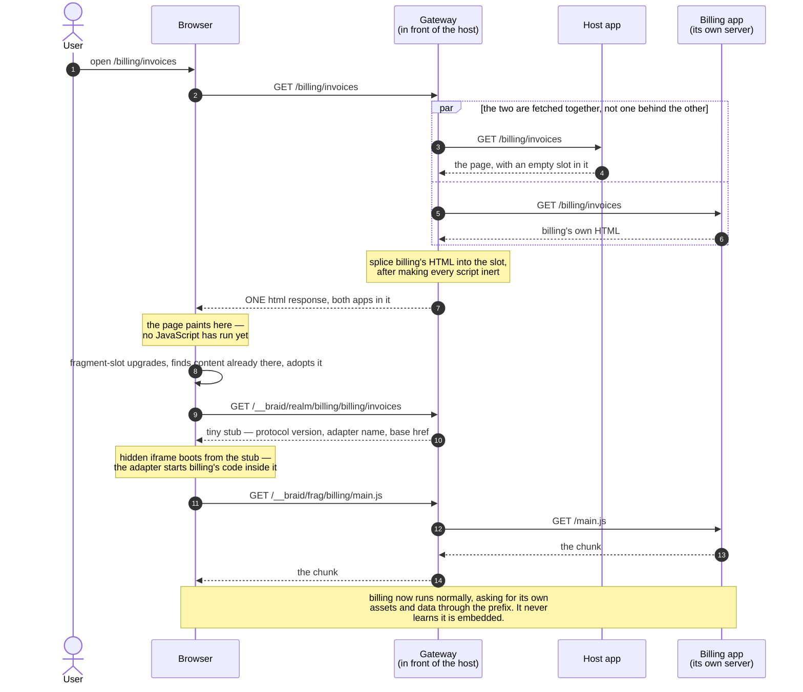

# Braid, explained

**Who this is for:** you have been handed a codebase that composes several frontend applications
into one page, and the words in it — _realm_, _slot_, _piercing_, _the namespace_ — do not mean
anything to you yet. Nothing here assumes you have built a micro-frontend before.

By the end you will be able to read a network tab full of `/__braid/…` requests and say what each
one is for, and why it exists.

---

## 1. The problem, before any jargon

Say four teams work on one website. Billing owns the invoices page, Payments owns a widget, and so
on. Everybody wants to deploy on their own schedule without a release train.

The obvious approaches each break somewhere:

**Put it all in one app.** Then one team's deploy is everyone's deploy. Their broken build is your
broken build, and upgrading React is a company-wide project.

**Use iframes.** Real isolation, and genuinely fine for some things. But an iframe is a box: it
cannot lay out with the page around it, a modal inside it cannot cover the page, screen readers see
separate documents, and every iframe reloads its own copy of the framework.

**Load everyone's JavaScript into one page** (this is roughly what Module Federation does). Now the
layout is fine and there is one accessibility tree — but everyone shares one global scope. Two
copies of React fight. One team's polyfill patches a prototype and breaks another team's code, on a
Tuesday, with no error pointing at the cause.

Braid takes a fourth path, and the whole architecture follows from it:

> **Split where the code _runs_ from where the DOM _lives_.**
>
> Each app's JavaScript runs in its own hidden, isolated JavaScript context. Its rendered HTML lives
> in the main page, in normal layout flow, in one accessibility tree.

You get the isolation of an iframe with the page behaving as one page. Everything below is the
machinery that makes that trick work.

---

## 2. How it works

### Fragment

**One of the independently deployed applications.** The billing app is a fragment. The notifications
panel is a fragment.

A fragment is an ordinary web app served by an ordinary web server. It usually contains no Braid
code at all — the POC's remotes have none. "Fragment" describes the _role_ an app plays in a
composed page, not a kind of app you have to build.

### Host (or shell)

**The application that owns the page.** It renders the layout, the navigation, and the places
fragments appear. When you open the site, its HTML is the page you get.

### Slot — `<fragment-slot>`

**The element in the host's HTML that says "a fragment goes here".**

```html
<fragment-slot name="billing"></fragment-slot>
```

That is the entire host-side integration for one fragment: an element, and the fragment's id. The
host does not import the billing app, does not know its URL, and does not know what framework it is
written in. It names it and leaves a hole.

It is a real custom element (`libs/core/src/elements/fragment-slot.ts`) and it does the work:
fetching the fragment, creating its isolated context, putting its DOM on the page, and cleaning all
of that up when the element is removed.

### Realm

**The isolated JavaScript context a fragment's code runs in.** In practice: a hidden `<iframe>`,
`display:none`, same origin as the host.

This is usually the first thing that makes people squint — _an iframe? I thought we were avoiding
those._ The distinction is what the iframe is used for:

|                                  | Normal iframe | Braid realm          |
| -------------------------------- | ------------- | -------------------- |
| Where the fragment's JS runs     | in the iframe | in the iframe        |
| Where the fragment's DOM appears | in the iframe | **in the host page** |
| Participates in page layout      | no            | yes                  |
| Separate accessibility tree      | yes           | no — one tree        |

The iframe is used purely as a **second JavaScript world**. Its own document is nearly empty; the
UI it produces is placed into the host page.

Why an iframe rather than something tidier? Because the browser gives you no other way to get a
second, synchronous, DOM-capable JavaScript context in a page. A Worker has no DOM and cannot run
synchronously with the page. There is no third option. So: hidden iframe.

**What isolation buys you.** Each realm has its own `window`, its own globals, its own module
registry. Fragment A can load React 18 while fragment B loads React 19 and neither can see the
other. When a fragment is removed, its realm is destroyed and everything it did goes with it.

### Shadow root

**Where a fragment's DOM actually lands**, inside the slot element.

A shadow root is a browser feature that gives an element a private subtree: styles inside do not
leak out, and the host's styles do not leak in. So a fragment's markup lives in the page — laid out
normally, readable by assistive technology, selectable, printable — without its CSS colliding with
anyone else's.

So a mounted fragment is two halves that point at each other:

```
Host page DOM                          Hidden realm (iframe)
─────────────────────────────          ──────────────────────────
<fragment-slot name="billing">         the billing app's JavaScript
  #shadow-root                    ←→   runs here, and reaches through
    <braid-document>                   a facade to the DOM on the left
      <h1>Invoices</h1>
```

### Adapter

**The piece that knows how to start one particular kind of fragment**, and connect it to the realm
and shadow root. Which adapter a fragment uses is declared in its manifest.

Two ship today:

- **`compat`** (the default) — for apps that cannot be modified. The adapter builds a convincing
  illusion _inside the realm_: the app's code thinks it has a normal `document`, `window`,
  `location`, and history, while all of it is actually wired to its shadow root and its route. An
  unmodified Angular or React app runs as a fragment with **zero code changes** — configuration
  only.
- **`custom-element`** — for a fragment that is already a web component. No emulation at all: the
  element is created inside the realm, then moved into the host's DOM.

"Framework adapter" in older docs means the same thing pointed at a specific framework's extension
points (Angular's `DOCUMENT` token, React's `createRoot`) instead of at emulation.

The trade is worth stating plainly: `compat` asks nothing of the app and pays for it with an
emulation layer; a contract adapter asks the app for a few lines and needs no emulation.

### Piercing

**The server writing a fragment's HTML into the page before the browser ever sees it.**

Without it, a page load looks like: HTML arrives → JavaScript boots → slot fetches the fragment →
fragment appears. The user watches an empty box for a moment.

With piercing, the gateway fetches the host's HTML _and_ the fragment's HTML at the same time, and
splices the second into the first as it streams past. The fragment's content is in the very first
response — already painted, before any JavaScript runs. `curl` the page and it is right there. While the host requires server-side rendering to do this, none of the fragments require it.

The spliced-in markup is wrapped in a _declarative shadow root_: HTML that tells the browser "make
this a shadow root as you parse it". So the browser builds exactly the structure the client would
have built, and when the slot's JavaScript starts it finds the DOM already correct and **adopts**
it rather than fetching anything.

### Born inert

**A safety property of any fragment HTML that lands in the host page.**

Fragment markup arrives in the host's DOM, so if it could execute, it would execute _in the host's
world_ — exactly the isolation Braid exists to provide, gone in one line of someone else's HTML. So
before any fragment HTML reaches the page, the gateway defuses it: every `<script>` is retyped to
`type="inert"` (its real type parked in `data-script-type`), inline `onclick`-style handlers are
stripped, and `<meta http-equiv="refresh">` is defanged.

The scripts are then re-activated **inside the fragment's realm**, which is where they were always
meant to run.

### Invariant

**A rule the system guarantees, always, not "usually".**

Docs say "invariant" instead of "rule" to mark the ones that are enforced and tested rather than
merely intended. Braid's big one is **host purity**: _Braid never modifies globals or prototypes on
the host page._ Even the compat adapter's heavy emulation is confined to the fragment's own realm.
There is a test suite whose entire job is to fail if `Node.prototype` or `history.pushState` is
touched on the host.

That matters because the alternative is the failure mode everybody has lived through: some library
patched a global, and three months later an unrelated feature breaks with no trail leading back.

### Trust tiers

**How much the host trusts a fragment's code**, with the isolation adjusted to match.

- **Trusted** (the default, and all this build ships): a same-origin realm. Isolated JavaScript,
  but the _origin_ is shared — cookies, `localStorage`, and IndexedDB are the host's. Right for code
  your organization owns.
- **Untrusted** (`trust="untrusted"`, **designed, not built**): a cross-origin sandboxed iframe for
  third-party code, so it cannot reach the origin's storage or cookies at all.

Today the slot throws a named error if you ask for the untrusted tier, which is the honest behaviour
— quietly downgrading to same-origin would give you a security boundary that does not exist.

### Blob booting

Every realm is an iframe, and every iframe needs a document to start from. **Blob booting is one of
the two ways of giving it one** — and the difference between them explains a URL you will see in the
network tab, so it is worth ten lines.

| | HTTP boot (`compat-http`) | Blob boot (`contract-blob`) |
| --- | --- | --- |
| The iframe's `src` is | `/__braid/realm/billing/…` on your origin | `blob:https://yoursite/8f3e…` |
| Getting that document costs | a request to the gateway, and waiting for the answer | nothing — it is already in memory |
| Can rewrite its own URL | yes | no |
| Touches session history | yes, so it has to be careful not to corrupt it | never |

**How the blob comes to exist.** No server is involved at any point. The client runtime builds the
realm document as a *string*, in the browser, at boot:

```ts
const html =
  `<!doctype html><meta charset="utf-8"><title>Braid realm: billing</title>` +
  `<meta name="braid-protocol" content="2">` +
  // so the fragment's relative URLs resolve into its own namespace
  `<base href="https://yoursite/__braid/frag/billing/">` +
  // this fragment's own dependency map, private to this realm
  `<script type="importmap">{"imports":{}}</script>`;

const blobUrl = URL.createObjectURL(new Blob([html], { type: 'text/html' }));
iframe.src = blobUrl; // the browser reads it straight from memory
```

`URL.createObjectURL` hands back a `blob:` URL pointing at a chunk of memory in this tab. When the
iframe loads it, the browser reads those bytes directly: no socket, no cache lookup, no gateway,
nothing that can be slow or down. **That is how the round trip is avoided** — not a clever
optimization, simply no request to make. Once the iframe has loaded the URL is revoked, and the
document it created lives on. The real thing is `createContractBlobRealm` in
[`libs/core/src/realm/realm-manager.ts`](https://github.com/braidjs/braid/blob/main/libs/core/src/realm/realm-manager.ts).

The import map in there is the quiet payoff. Every realm gets its own document, so every realm gets
its own import map for free — which is how two fragments ship different majors of the same
dependency with no shared resolution namespace to fight over.

**Why compat fragments cannot use it.** A compat fragment's code believes it owns the browser: it
reads `location.pathname` expecting its own route, and calls `history.pushState`. The realm keeps
that belief truthful by loading a real URL and then calling `history.replaceState` to make the
realm's URL *look* like the fragment's route. **You cannot `replaceState` a `blob:` document to an
`http:` URL** — the browser refuses, since that would let any page rewrite an opaque URL into
something that looks like a real address.

So compat realms boot from a real URL — the realm stub the gateway serves — and pay a round trip for
it. Contract-mode fragments read `env.location` and `env.document` instead of realm globals, so
there is no illusion to maintain, nothing to `replaceState`, and the blob is free to be a blob.

**How to switch your app to it: today, you cannot.** Both adapters that ship declare
`realmKind: 'compat-http'`, and that is the kind the slot boots. Blob realms are implemented and
exported — `createRealm('contract-blob', { fragmentId, routeUrl, bound, signal, importMap })` works
if you are writing your own adapter — but no manifest field selects one and there is no flag to flip.
When contract adapters ship, the choice will be a property of the adapter rather than a knob, because
it is not a preference: an adapter that needs the location illusion cannot have a blob, and one that
does not, should.

If you do use it, one deployment note: a host page with a restrictive Content Security Policy has to
allow `blob:` in `frame-src`, or the realm will not load. Braid's error for that failure says so.

### So what does my Angular app get?

Worth answering directly, because two different things in this repo have "Angular" in the name.

**An Angular app running as a fragment** uses the `compat` adapter — it is the default, and the only
one that suits a whole application — so it gets a **`compat-http` realm**: the realm stub, one round
trip, and the location illusion its router depends on. That is not a limitation of Angular; a React
or Vue app running as a fragment gets exactly the same thing, for the same reason. The POC's
`braid-poc-remote` (Angular) and `braid-poc-react-remote` (React) both boot this way.

**`@braidlabs/angular` is a host-side package**, and it does not pick a realm at all. It gives an
Angular *host* a `<braid-fragment>` component to render slots with typed inputs and outputs, and
`provideBraid()` to tell Braid when the router navigates. If your Angular app is the shell, that is
the package you want; if it is the fragment, you need nothing at all.

The only fragment that skips the emulation today is one that ships a custom element
(`adapter: 'custom-element'`) — and even that one uses a `compat-http` realm, because it is the kind
the slot boots. Nothing in this build boots from a blob.

---

## 3. What happens when you load a page

Here is one navigation to `/billing/invoices`, from the first byte to a running fragment. This is
the narrative the URL table in §4 is a reference for.



### Step 1 — the browser asks for the page

```
GET /billing/invoices
```

The gateway is middleware sitting in front of the host app, so it sees this first. It checks the
registry: does any fragment declare that it appears on this URL? Billing does.

### Step 2 — the gateway fetches two things at once

It asks the host app for the page, **and** the billing app for its HTML, in parallel:

```
(to the host app)     GET /billing/invoices
(to billing's server) GET /billing/invoices
```

Nothing is serialized behind anything else. Note that the fragment is asked for _the page's own
path_ — a fragment that renders a screen wants to know which screen. (A widget that appears on every
page is asked for its own fixed path instead; that is `bound: false` with `src`, see §5.)

### Step 3 — the gateway splices them together

As the host's HTML streams past, the gateway watches for `<fragment-slot name="billing">`. When it
appears, it injects billing's HTML into it as a declarative shadow root — after defusing it, per
_born inert_.

The browser receives **one HTML response** containing both apps' markup, and paints it. There has
been no client-side JavaScript involved at all.

### Step 4 — the slot element wakes up

The host's JavaScript loads and `<fragment-slot>` upgrades. It looks inside itself, finds content
already pierced in, and **adopts it** — no fetch, no re-render, no flash. (If the page was _not_
pierced — a client-side navigation, say — it fetches the fragment's document instead. That is the
`/__braid/doc/…` request in §4.)

### Step 5 — the realm boots

In parallel with step 4, the slot creates the hidden iframe and points it at the **realm stub**:

```
GET /__braid/realm/billing/billing/invoices
```

The stub is a nearly empty HTML document. It carries three things that matter: the Braid protocol
version, the adapter name from the fragment's manifest, and a `<base href="/__braid/frag/billing/…">`
so that every relative URL the fragment's code later requests resolves into billing's own asset
namespace rather than the host's.

That path repeats itself because it is two things: `/__braid/realm/billing/` (whose realm) followed
by `/billing/invoices` (which route it should appear to be on).

### Step 6 — the adapter takes over

The slot reads the adapter name off the stub and runs it. For `compat`, the adapter installs the
emulation inside the realm, `replaceState`s the realm's URL to `/billing/invoices` so the app's
router sees its own route, and re-activates the inert scripts **in the realm**.

### Step 7 — the fragment's own requests

Billing's JavaScript now runs and asks for its chunks, styles, and data. Because of that `<base>`,
those requests go to:

```
GET /__braid/frag/billing/main-A1B2C3.js
GET /__braid/frag/billing/styles.css
GET /__braid/frag/billing/api/invoices
```

The gateway strips the `/__braid/frag/billing` prefix and forwards each to billing's own server,
which sees exactly the paths it would serve if it were running standalone. **It never learns it is
embedded.**

That is the whole load. One HTML response with everything in it, one tiny stub, and then a normal
app making normal requests through a prefix.

---

## 4. The `/__braid/` URLs

All Braid traffic lives under one reserved prefix so it can never collide with the host's own routes.
Each path segment after it names _what kind_ of thing you are asking for, then _which fragment_.

```
/__braid/ frag  / billing / main.js
   │        │        │         └── the path on the fragment's own server
   │        │        └──────────── which fragment (its manifest id)
   │        └───────────────────── what kind of request
   └────────────────────────────── reserved namespace
```

| URL                              | Who asks                 | When                                         | What comes back                                                                                                                                                                                                                            |
| -------------------------------- | ------------------------ | -------------------------------------------- | ------------------------------------------------------------------------------------------------------------------------------------------------------------------------------------------------------------------------------------------ |
| `/__braid/realm/:id/:route`      | the slot, in the browser | every fragment boot                          | A tiny HTML stub for the hidden iframe: protocol version, adapter name, and a `<base>` pointing into the fragment's asset namespace. Cacheable for an hour and varies on nothing.                                                          |
| `/__braid/doc/:id/:route`        | the slot, in the browser | only when the page was **not** pierced       | The fragment's HTML, already prepared for the host's DOM: singletons renamed, scripts made inert, subresource URLs re-rooted. Identical to what piercing injects. `204 No Content` for fragments that ship a script instead of a document. |
| `/__braid/frag/:id/*`            | the fragment's own code  | constantly, after boot                       | Whatever the fragment's server returns, forwarded verbatim with the prefix stripped — JS, CSS, images, API calls, WebSocket upgrades.                                                                                                      |
| `/__braid/registry`              | anyone (opt-in)          | when a shell builds its UI from the registry | A paginated JSON list of fragments, filtered by who is asking. Off unless configured: a registry describes internal topology.                                                                                                              |
| `/__braid/registry/appd/v2/apps` | FDC3 tooling (opt-in)    | app-directory lookups                        | The same list in FDC3 App Directory shape, under the same access rules.                                                                                                                                                                    |
| `/__braid/sw.js`                 | the browser              | once, if the shell registers it              | The generated service worker, with the `Service-Worker-Allowed` header that lets it claim the whole origin.                                                                                                                                |

You may also see paths under `/__braid/` that the gateway knows nothing about — the POC mounts its
registry console at `/__braid/console`, for instance. The prefix is reserved for Braid-shaped things
generally, and an application is free to put its own tooling there; the gateway only claims the
routes in the table.

**One header worth knowing when reading a network tab.** A composed page comes back with
`x-braid-fragment-id` listing every fragment that was pierced into it, in order. If a fragment is
missing from the page, that header tells you whether the gateway tried and failed, or never matched
the URL at all.

Two rules explain most of the design here:

**Addressing is by id, exactly.** `/__braid/frag/billing/…` is billing's, always. There is no header
sniffing and no "closest match" — an unknown id is a 404, never a fallback to the shell. Ambiguity in
routing is the kind of bug that shows up as one app mysteriously serving another's assets.

**`pierce` patterns are not routing.** A manifest's `pierce: ['/billing/*']` says only _which page
URLs this fragment appears on_, for the server-side splice. It never decides where an asset request
goes; that is always the exact id-addressed namespace above.

### Why `/__braid/realm/…` and `/__braid/frag/…` are separate

They look redundant — both end up at the same fragment — but they are cached completely differently.
A realm stub is identical for every user and varies on nothing, so it can sit in a CDN for an hour.
A fragment's assets and API responses vary by user, cookie, and encoding. One prefix for both would
mean the cache rules for the safest thing in the system and the least safe thing in the system would
have to be the same rules.

---

## 5. Two kinds of fragment

The distinction runs through the codebase, and the words for it are **bound** and **unbound**.

**Bound (the default) — a fragment that is a screen.** It lives at certain routes, follows host
navigation, and is fetched at the page's own path. Billing is bound: on `/billing/invoices` the
gateway asks billing's server for `/billing/invoices`.

**Unbound — a fragment that is chrome.** A header panel, a sidebar, a global search box. It appears
on every page and its content lives at one fixed address. It declares that:

```jsonc
{ "id": "notifications", "bound": false, "src": "/panel", "pierce": ["/", "/*"] }
```

Without `bound: false`, the gateway would ask the notifications server for `/billing/invoices` — a
question it has no answer to, producing an empty widget on every page. The host's template names the
same path, so the client boots it in the same place the server fetched it from:

```html
<fragment-slot name="notifications" src="/panel"></fragment-slot>
```

---

## 6. Questions people actually ask

**Is there a whole framework loaded per fragment?** Yes, per fragment, and that is the deliberate
trade: independence costs bytes. Fragments on the same page do not share a React instance, because
sharing one is exactly what makes independent deployment impossible.

**What if a fragment's server is down?** The page still renders. The slot is marked
`data-braid-fallback` and the client tries to boot the fragment itself, so a transient failure
self-heals rather than becoming a broken page. A manifest can opt into a visible error instead
(`fallback: 'error-html'`) when a missing section is worse than a visible failure.

**What if it is slow?** Each fragment has a `timeoutMs` budget. Past it the gateway stops waiting and
degrades to the same fallback — one slow widget cannot hold the whole page. This is measured in the
POC: a 2s widget against a 400ms budget delayed the page by 407ms, not 2s.

**Do fragments share cookies and storage?** Under the trusted tier, yes — it is one origin. That is
convenient (one session) and it is why the tier is called _trusted_. Storage isolation is what the
untrusted tier is for, and it is not built yet.

**Can a fragment break the host?** Not by loading, and this is enforced rather than hoped for: its
markup arrives inert, its code runs in another realm, and the host purity invariant is tested in CI.
It can still be slow, and it can still render something ugly.

**Why is the fragment's HTML full of `<braid-html>` and `<braid-body>` tags?** Because a document
may only have one `<html>`, `<head>`, and `<body>`. A second set inside the page would be silently
dropped by the parser, taking the fragment's content with it, so they are renamed on the way in.

**Do I need the gateway?** For piercing and the namespace, yes. There is a client-only path with a
smaller feature set — see [braid-without-gateway.md](braid-without-gateway.md).

---

## Where to go next

- [braid-poc.md](braid-poc.md) — a running example: three frameworks and a server-rendered widget on
  one page, with the commands to start it
- [braid-failure-modes.md](braid-failure-modes.md) — what goes wrong in practice, by symptom. Read
  this before debugging anything
- [braid-architecture.md](braid-architecture.md) — the full design and its rationale
- [braid-from-module-federation.md](braid-from-module-federation.md) — if you already know Module
  Federation, start here instead
