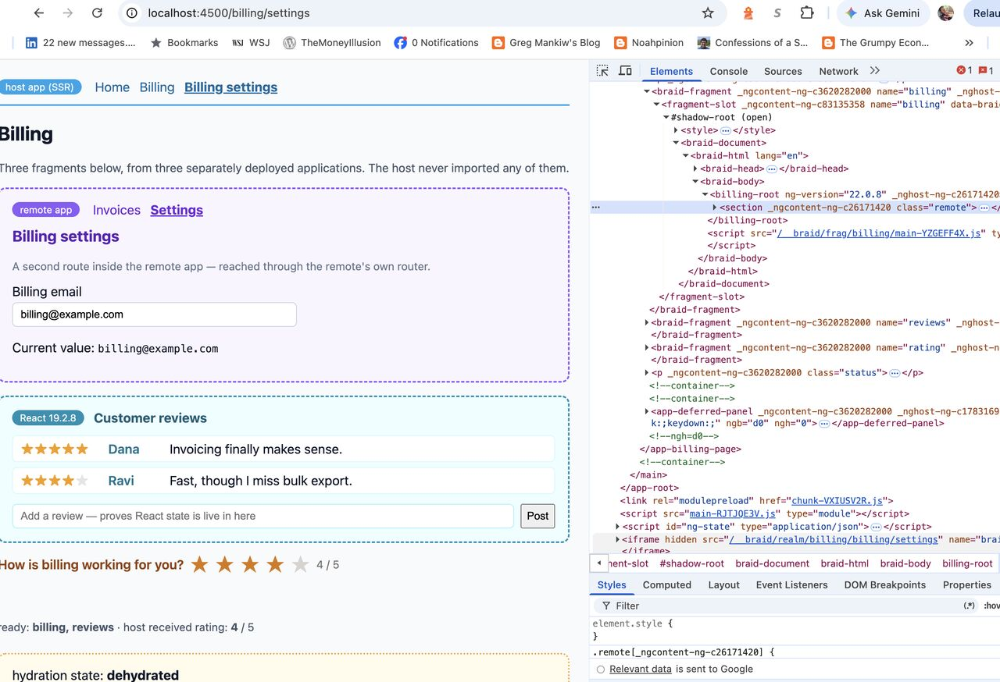

# Braid POC — two Angular apps, one page

A working demonstration of the compat adapter: a **host** Angular app with SSR composes a
separately built, separately deployed **remote** Angular app into its own page, through the
Braid gateway. Neither app imports the other.

```bash
node tools/braid-poc/run.mjs
```

Then open <http://localhost:4500/billing/invoices>.

**If the words below are new** — fragment, realm, slot, piercing, those `/__braid/` URLs in the
network tab — read [**Braid, explained**](braid-explained.md) first. It covers what each one is and
why it exists, and this page will read very differently afterwards.

**Requires Node 24 or newer.** The gateway compiles pierce patterns with `URLPattern`, which is a
global only from Node 23.8; the runner checks for it before building anything.

| Piece | Where | What it is | Adapter |
| --- | --- | --- | --- |
| Host | `apps/braid-poc-host` | Angular SSR app; its Express server mounts the gateway in front | — |
| billing | `apps/braid-poc-remote` | Stock Angular SPA with its own router | compat (default) |
| reviews | `apps/braid-poc-react-remote` | A React 19 app, built with esbuild | compat (default) |
| rating | `apps/braid-poc-widget` | A single custom element, no build step, no framework | `custom-element` |
| notifications | `apps/braid-poc-notifications` | Angular app with **its own SSR**, unbound from the host router | compat (default) |

**Three frameworks on one page.** Angular hosts, Angular and React fragments render inside it,
and a framework-free web component sits beside them — none of them imported by the host, each in
its own realm with its own dependency graph.

**And one of them is chrome, not a screen.** The notifications panel in the header is a separately
deployed Angular app with its own server-side rendering, composed into *every* page — see
[Unbound fragments](#unbound-fragments-chrome-rather-than-a-screen) below.



## Unbound fragments: chrome rather than a screen

The billing fragment is a **screen**: it lives at `/billing/*`, follows host navigation, and is
fetched at whatever path the user is on. The notifications panel is **chrome**: it appears on every
page, has no relationship to the host's URL, and its content lives at exactly one address.

That distinction is two fields in the manifest:

```jsonc
{
  "id": "notifications",
  "endpoint": "http://localhost:4505",
  "bound": false,        // does not participate in host navigation
  "src": "/panel",       // where its content lives — fetched instead of the page path
  "pierce": ["/", "/*"], // appears on every page
  "timeoutMs": 400,
  "fallback": "placeholder"
}
```

and one attribute in the host's template:

```html
<fragment-slot name="notifications" src="/panel"></fragment-slot>
```

The path is declared in both places on purpose. The slot is what tells the *client* where to boot
the fragment, so writing it in the template makes an unbound fragment's mount path visible in the
host's own markup and identical whether or not the page was pierced — no metadata round trip, and no
dependence on `pierce` patterns happening to cover every route. The gateway fills the attribute in
when a template omits it, and warns when the two disagree, so the duplication cannot drift silently.

**Both sides render on the server, per request.** A `curl` of the host's `/` contains the panel's
rows — `Invoice 4821 was paid`, `3` unread — already inside the slot's declarative shadow root. Ask
the notifications origin for `/billing/invoices` directly and you get nothing: that path matches no
route there. The rows appearing on a host page whose own path is `/billing/invoices` are the proof
that the gateway asked for `/panel`.

**Angular hydrates inside the realm.** This was the open question the POC existed to answer. The
fragment's own Angular boots in its realm and hydrates against DOM living in the host's shadow root,
reached through the compat document facade — cleanly, with no NG0500-series errors, and with
incremental hydration intact: a `@defer (hydrate on interaction)` block *inside* the fragment stays
server-rendered and dehydrated until someone uses it.

**Every page pays for it, so the budget is tight.** With `pierce: ['/*']`, the widget's fetch is on
the critical path of every document request. Against a deliberately slowed origin (2s) the host's
`/` returned in **407ms** — the 400ms budget — with the slot marked
`data-braid-fallback="placeholder"` and the client left to boot the fragment itself. With the origin
stopped entirely, `/` returned in 8ms, complete, and the billing page still composed its own three
fragments. A widget that is down or slow costs its own absence, and nothing else.

---

## The demo page

<http://localhost:4500/demo> — panels that each make **one claim, offer one control, and show their
own proof**. The evidence is rendered in the panel on purpose: "open devtools and check the network
tab" is homework, not a demonstration.

| Act | Panels | What is claimed |
| --- | --- | --- |
| Composition | 1–3 | three apps, none importing the others; typing in one appears in another; neither can see the other's globals |
| Shared data | 4–7 | two apps fetched a record once between them; a rename in one refreshes the other; an edit shows before it is sent, and a server that disagrees says so |
| Offline and durability | 8–11 | queued work survives going offline, survives a reload, is flushed by exactly one tab, and is never taken by another app |
| Skew | 12–13 | one record on disk read at two contract versions, the older reader reporting what it could not carry |

Panel 9 is the one that earns `persistOutbox: true`. It runs two outboxes side by side that differ
in exactly one variable — the driver — queues the same mutation into both, and asks you to reload.
The persisted queue still lists its entries; the in-memory one reads `0 queued`. That zero is a
user's edit, gone after the UI said it saved, which is a claim worth showing rather than asserting.

Panels 6 and 7 are one mechanism seen twice. **"Your edit shows instantly. The server takes two
seconds"** is the optimistic overlay: the queued entry carries what it predicts, every reader
derives `confirmed ⊕ pending` from shared storage, and rolling back is deleting the entry — so the
queue and the overlay cannot drift apart, because they are the same records. **"The server
disagreed with your edit, so we told you"** is what happens when the prediction does not hold. The
stored record becomes the server's value either way; `onConflict: 'raise'` is the default because
the alternative edits the screen under someone who just typed something.

Panel 14 is the other half of the skew story, and the one people assume cannot work: a reader
**two versions behind, with no way back**. The v3 step declares no `down`, so nothing can project
its records down — which is exactly what a retired version looks like from below. The reader does
not discard the record as corrupt and does not guess at fields the writer never sent. It reports
`ahead` and asks the server for a version it understands, and the panel counts that request.

Panel 12 is the one nothing else can show: **`Luke Skywalker · Tatooine` beside
`Luke Skywalker · Tatooine — projected down from v2, dropped starships`**, from a single stored
record read through two chains.

Panel 2 is worth labelling precisely: it is **cross-realm reactive state, not a network feature**.
The host writes a prop, the adapter structured-clones it across the realm boundary, and the other
app renders it. Nothing leaves the page.

Reads come from SWAPI — a real third-party API, which is the point when the claim is about a shared
fetch — and writes go to a mock on the host with latency, failure, and offline switches, because an
outbox demonstrates nothing against a server that always succeeds instantly. `DEMO_FIXTURES=1`
serves committed copies when the network is unavailable.

Panel 14 — a reader too far behind to project, refetching rather than guessing — is the one act
four still lacks; see [the demo plan](https://github.com/braidjs/braid/blob/main/docs/plans/braid-data-demo-plan.md).

## What the POC actually proves

**The remote is a normal Angular app.** Look at `apps/braid-poc-remote` — no Braid import, no
adapter, no build plugin, no awareness of being embedded. It uses `provideRouter`, `routerLink`,
and `signal()` exactly as it would standalone. Its manifest entry declares no `adapter`, so it
gets compat, which is the default.

**The composition is server-rendered.** A document request to `/billing/invoices` returns one
response containing the host's SSR output *with the remote's markup already inside the slot* as a
declarative shadow root. `curl` it and read the HTML — the remote's `<billing-root>` is there,
its scripts are `type="inert"`, and its `styles.css` has been re-rooted to
`/__braid/frag/billing/styles-*.css`. The client adopts that markup instead of fetching it.

**Routing works in every direction**, with one realm throughout:

| Navigation                              | Result                                            |
| --------------------------------------- | ------------------------------------------------- |
| Host router → `/billing/settings`       | fragment switches to its Settings route           |
| Fragment `routerLink` → `/billing/…`    | host URL changes, host nav highlights update      |
| Browser back / forward                  | both stay in sync, natively via `popstate`        |

**The host page stays pristine.** `Node.prototype` and the History API are untouched; each
remote's globals stay in its own realm. Verified on the composed page: `window.React` is
`undefined` in the host, and `star-rating` is defined in the *fragment's* custom element registry
and not the host's — yet the upgraded element lives in the host's DOM. That is how the
`custom-element` adapter works: the element is created in the realm, where it upgrades against
the fragment's own definition, then moved into the host page, which preserves its class.

**A web component's events cross the boundary.** Clicking a star in the widget dispatches its own
`rating:change`, which the adapter republishes as a `braid:event`, which the Angular host receives
as a typed output and writes into a signal. Props go the other way as element properties.

**Incremental hydration coexists with fragments.** The billing page also carries a
`@defer (hydrate on interaction)` block. It is server-rendered but dehydrated; its JavaScript
chunk downloads only when you click it, then it hydrates and the triggering click is replayed —
on the same page where a fragment boots into its own realm. Neither mechanism disturbs the other.

**The gateway publishes its registry.** `GET /__braid/registry` lists the composable apps. The
POC runs in development mode, so it returns everything including internal endpoints; see the
[gateway README](https://github.com/braidjs/braid/blob/main/libs/braid-gateway/README.md) for how roles, permissions, and pagination work
in production.

**The registry console runs alongside it**, at
<http://localhost:4500/__braid/console/> — the same origin as the gateway, which is why it needs no
CORS, no second deployment, and no separate session. It reads `/__braid/registry` and writes to
`/__braid/registry-api`, and the POC mounts both.

Publishing there writes an immutable snapshot to `.braid/registry`. Note the gap the POC leaves
deliberately visible: **this gateway serves the inline manifests in `server.ts`**, so a published
snapshot changes nothing until a deploy pins its id. That is the model rather than a shortcoming of
the demo — configuration changes are deploys, which is what makes rollback a pointer move. See
[`@braidlabs/registry`](https://github.com/braidjs/braid/blob/main/libs/braid-registry/README.md).

## The host's entire integration

The host uses [`@braidlabs/angular`](https://github.com/braidjs/braid/blob/main/libs/braid-angular/README.md), so the integration is
one provider and one element:

```ts
// main.ts
providers: [...appConfig.providers, provideBraid({ dev: true })];
```

```html
<!-- billing-page.ts -->
<braid-fragment name="billing" (ready)="onReady($event)" />
```

Plus the gateway registration in `server.ts`. That is the complete cost of hosting a fragment.

`provideBraid()` handles the router wiring that bound fragments need — subscribing to
`NavigationEnd`/`NavigationSkipped` rather than every router event, which is the difference
between a fragment that follows the host and one that lags a navigation behind. The component
keeps the page's templates strictly checked (no `CUSTOM_ELEMENTS_SCHEMA`) and turns
`braid:ready`/`braid:error` into typed outputs.

## Two things worth knowing

**Use an after-navigation hook, not every router event.** `NavigationStart` fires *before* the
URL changes; notifying then reports a location the page hasn't reached. The bus now tolerates
this (it keys duplicate-suppression on the URL, not on time alone), but filtering to
`NavigationEnd` is the correct wiring.

**Hydration is load-bearing.** Without `provideClientHydration()` on both bootstraps, Angular
discards the server-rendered DOM and re-creates it — destroying the slot the gateway just filled
and booting a *second* realm to fetch the fragment again. With hydration there is exactly one
realm, and the pierced content is what you see.

State note: navigating away from a fragment route and back re-creates the remote's routed
component, so component-level state resets — the same thing that happens in the remote
standalone. The realm and the application inside it are never rebooted.
