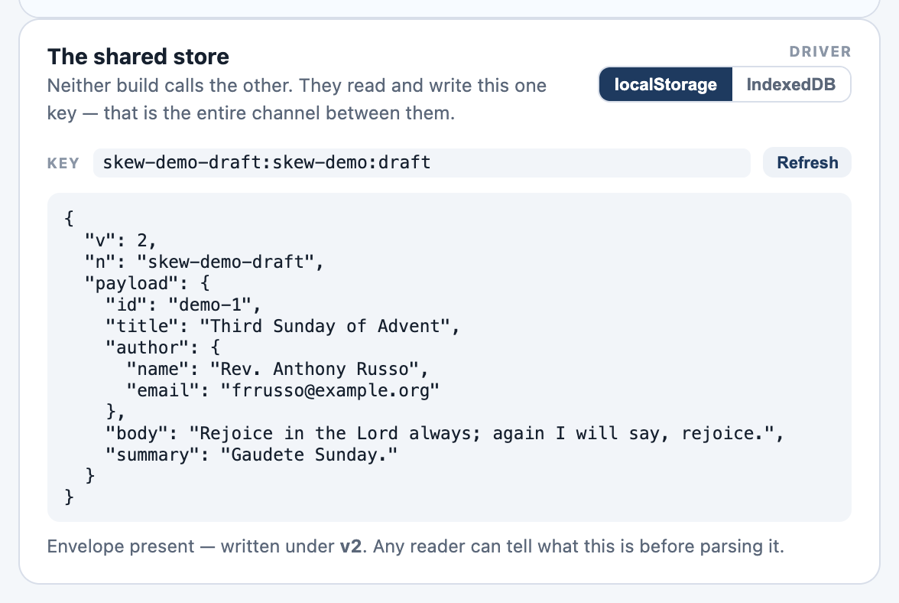
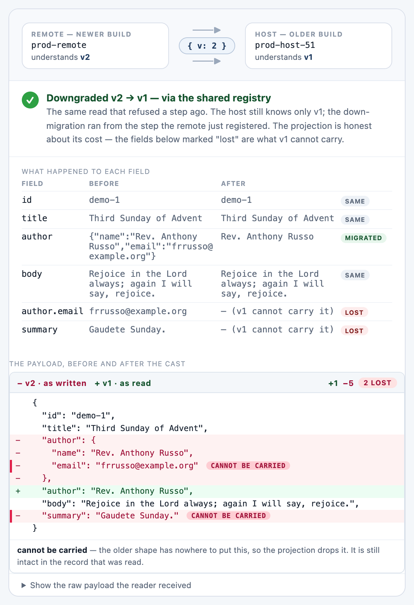

# Tutorial 1 — Version the data, not the deploy

**Package:** `@skewkit/core` · **Time:** ~25 minutes · **Prerequisites:** any
TypeScript project. No framework required — everything here runs in Node, a
browser, or a test.

You are going to build a versioned `Draft` record and walk it through the
whole life of a schema: the first shape, a rename, a structural promotion,
data arriving *from the future*, and the storage layer that makes all of it
survive a redeploy. At every step you will see exactly what would have broken
without the envelope.

```sh
npm install @skewkit/core
```

---

## Step 1 — Declare the shape you have today

A schema starts from your *current* shape. There is nothing to migrate yet —
the point is to start writing envelopes now, so every future reader can tell
what it is looking at.

```ts
import { versioned } from '@skewkit/core';

interface DraftV1 {
  id: string;
  title: string;
  author: string;   // a plain string — this will matter in step 3
  body: string;
}

export const Draft = versioned<DraftV1>('draft');
```

Two things deserve attention:

- `'draft'` is the **contract name**, not a variable name. It is how a reader
  on a different build — or a different application entirely — recognises
  that an envelope belongs to this schema. Envelopes that name a *different*
  contract are refused instead of being misread.
- The type parameter is your *live* interface, and that is fine — for now.
  The moment you add a second version (step 3), the old shape gets frozen.

Write and read a record:

```ts
const envelope = Draft.write({
  id: 'demo-1',
  title: 'Second Sunday of Advent',
  author: 'Rev. Bernard J. Miller',
  body: 'Prepare the way of the Lord, make straight his paths.',
});

console.log(envelope);
// { v: 1, n: 'draft', payload: { id: 'demo-1', ... } }

const result = Draft.read(envelope);
if (result.ok) console.log(result.value.title);  // typed as DraftV1
```

The envelope is the entire mechanism: `v` is the version the payload was
*authored* under, `n` is the contract it belongs to, and both sit outside the
payload so a reader can decide what to do before trusting a single field.

Here is what that looks like on disk in the demo's shared-store panel — note
the `v` and `n` fields traveling with the record:



---

## Step 2 — Read like you mean it

`read()` returns a **result**, never a naked value and never an exception.
Handle every reason — they demand different remedies:

```ts
const result = Draft.read(whatever);

if (!result.ok) {
  switch (result.reason) {
    case 'ahead':    // written by a NEWER build; see step 4
      return refetch();
    case 'gap':      // a migration step is missing — a bug, be loud
      return reportBug(result.message);
    case 'invalid':  // not this contract's data at all
      return discard();
    case 'threw':    // a migration blew up on this input
      return reportBug(result.message);
  }
}

render(result.value);
```

The habit that matters more than any other line in this tutorial:
**`.read(body)` where you were about to write `body as Draft`.** The cast
compiles either way; only one of them tells you when it is wrong.

---

## Step 3 — The shape changes

Product wants the author split into a structured value, and a summary line.
This is the moment most codebases silently corrupt themselves. Do it the
versioned way instead.

First, **freeze the old shape**. `DraftV1` stops being your live interface
and becomes a historical fact:

```ts
/** v1, frozen. This is what v1 looked like, forever. Never edit it again. */
interface DraftV1 {
  id: string;
  title: string;
  author: string;
  body: string;
}

export interface DraftV2 {
  id: string;
  title: string;
  author: { name: string; email: string };
  body: string;
  summary: string;
}
```

Then extend the chain with `next()`. The description is required — it is the
step's identity, and the only thing two independently built bundles can
compare a code step by:

```ts
export const Draft = versioned<DraftV1>('draft').next<DraftV2>(
  'structure the author and derive a summary',
  {
    up: (v1) => ({
      id: v1.id,
      title: v1.title,
      author: { name: v1.author, email: '' },   // email: a guess
      body: v1.body,
      summary: v1.body.slice(0, 60),            // summary: derived
    }),
    derives: ['author.email', 'summary'],
  },
);
```

Each step is typed against the previous version — a migration that does not
produce the next shape is a **compile error**. Now read a v1 envelope:

```ts
const result = Draft.read({ v: 1, payload: oldRecord });

if (result.ok) {
  result.value;         // typed DraftV2 — migrated on the way out
  result.migratedFrom;  // 1
  result.derivedPaths;  // ['author.email', 'summary']
}
```

`derivedPaths` is the part teams skip and regret. "It migrated" is not one
fact — `author.name` came from somewhere real; `summary` is the migration's
best guess from a shape that never carried the field. Anything downstream
that treats a derived value as a reported one is trusting a guess, and this
list is how it can tell.

> **The one rule.** A migration must never reference your live interfaces.
> Close each step over its own frozen snapshot (`DraftV1`, `DraftV2`, …). A
> migration that imports a live type silently changes meaning the next time
> that type is edited — and starts lying about what it produces.

---

## Step 4 — Data from the future

Your deploy pipeline does not pause the world. While one tab runs yesterday's
build, a colleague's tab writes with today's — same storage key, newer
envelope. What should yesterday's build do with `{ v: 2, … }`?

Plainly declared, the honest answer is *refuse*:

```ts
const OldReader = versioned<DraftV1>('draft');   // yesterday's build

const result = OldReader.read({ v: 2, payload: v2Record });
// result.ok === false, result.reason === 'ahead'
// "data was written by a newer build (v2) than this one (v1)…"
```

The fields v2 added were never sent to a v1 reader — *guessing* them away
would silently discard data. But refusal is a diagnosis, not always a dead
end. Renames and structural promotions are honestly invertible, and a step
can say so by declaring its **down** direction:

```ts
export const Draft = versioned<DraftV1>('draft').next<DraftV2>(
  'structure the author and derive a summary',
  {
    up:   (v1) => ({ /* as above */ }),
    down: (v2) => ({
      id: v2.id,
      title: v2.title,
      author: v2.author.name,   // the projection back
      body: v2.body,
    }),
    derives: ['author.email', 'summary'],
    lossy:   ['author.email', 'summary'],   // what the projection drops
  },
);
```

With a down direction available, the same read succeeds as an **explicitly
lossy projection**:

```ts
const result = Draft.read(newerEnvelope);
if (result.ok) {
  result.downgradedFrom;  // 2 — this value is a projection, not the record
  result.lossyPaths;      // ['author.email', 'summary'] — its price, named
}
```

And the *writer* can be polite to a reader it knows is older:

```ts
Draft.write(v2Value, { as: 1 });   // down-migrates, emits { v: 1, … }
```

This is the demo's Basics walkthrough, steps 3–5: the newer build writes v2,
the older build refuses, then the newer build shares its chain and the exact
same read returns the projection — with the dropped fields labeled **LOST**:



(The sharing mechanism — `registerSchema` and the page-wide registry — is
what lets two *separately built bundles* lend each other migration knowledge.
It matters most under module federation; see the walkthrough's step 5 and
`libs/core/src/lib/registry.ts` when you get there.)

---

## Step 5 — Keep migrations deterministic

Migrations receive a context as their second argument. Take the clock — and
anything unique-but-reproducible — from it, never from `new Date()` or
`Math.random()` inside the body:

```ts
.next<DraftV2>('add createdAt', {
  up: (v1, ctx) => ({ ...v1, createdAt: ctx.now().toISOString() }),
  derives: ['createdAt'],
})
```

Why this is a rule and not a preference: the same input must produce the same
output, or replays, retries, memoization, and tests all quietly lie. Pin the
clock in a test and the whole chain becomes reproducible:

```ts
import { describe, expect, it } from 'vitest';

const pinned = { now: () => new Date('2026-08-10T12:00:00.000Z') };

it('migrates deterministically', () => {
  const a = Draft.read(stored, { context: pinned });
  const b = Draft.read(stored, { context: pinned });
  expect(a).toEqual(b);   // exactly — including derived timestamps
});
```

(A real-world case from this repo: an idempotency key derived from
`Date.now()` minted a *new* identity on every retry — the one property an
idempotency key must not have. `ctx.seed` exists for exactly that value.)

---

## Step 6 — Storage that doesn't lie to you

`JSON.parse(raw) as Draft` is an assertion, not a check. The day the model
changes, every cached record on every user's machine has the old shape while
being *typed* as the new one. Route storage through the schema instead:

```ts
import { createVersionedStore, webStorageDriver } from '@skewkit/core';

const drafts = createVersionedStore(Draft, {
  driver: webStorageDriver('local'),
  onReadFailure: (key, failure) =>
    telemetry.warn('stale draft', { key, reason: failure.reason }),
});

await drafts.set('demo-1', draft);        // writes the envelope
const result = await drafts.get('demo-1'); // migrated on the way out

const now = drafts.peek('demo-1');         // sync — no flash of empty state
```

Three details worth knowing:

- **Adoption needs no backfill.** Un-enveloped legacy rows read as v1, so
  declare your current shape as the base and old records upgrade themselves
  as users touch them.
- **`peek()` is synchronous** on sync drivers (`localStorage`, memory), which
  is what lets a component initialise without flashing empty state. On an
  async driver (`indexedDbDriver()`) it honestly returns `null` instead.
- **`onReadFailure` is how you find bad migrations before users report
  them.** Wire it to telemetry on day one.

---

## Step 7 — Declare migrations as data (ops)

The closure in step 3 can only travel inside the bundle that compiled it. The
same migration declared as **ops** is data — mechanically invertible, with
`down`, `derives`, and `lossy` computed instead of hand-written:

```ts
export const Draft = versioned<DraftV1>('draft').next<DraftV2>(
  'structure the author and derive a summary',
  {
    ops: [
      { wrap: { path: 'author', key: 'name', also: { email: { $value: '' } } } },
      { default: { path: 'summary', value: '' } },
    ],
  },
);
```

The op set is closed and non-Turing-complete on purpose: `rename`, `move`,
`wrap`, `hoist`, `map`, `default`, `drop`, `convert`, `const`. Structural
evolution fits it; semantic transforms (deriving `summary` from `body`, say)
deliberately do not — those stay as code. This split is what makes it safe
for an API to *publish* its migrations as a document a client can fetch at
runtime (`@skewkit/contract`), which is where the `ahead` story gets its
final act. That is its own tutorial's worth of material — see the
[`@skewkit/contract` README](../../libs/contract/README.md) when you are
ready.

---

## What you built

A contract that survived a rename and a structural promotion, migrates
forward with its guesses labeled, migrates backward with its losses named,
refuses what it cannot honestly read, stores durably, and is reproducible
under test. The deploy stopped being an event your data has to fear.

**Next:** [Tutorial 2 — Give your build a name](02-build.md), where the
*code* gets the same treatment the data just got.
