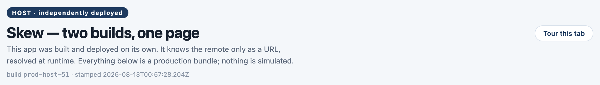

# Tutorial 2 — Give your build a name

**Package:** `@skewkit/build` · **Time:** ~15 minutes · **Prerequisites:**
any bundled web app (Angular CLI, Vite, webpack — the tool is agnostic).

Version skew is two parties disagreeing about which version of the world they
are in. Tutorial 1 gave the *data* a version; this one gives the *deployment*
one — a stamped identity, a manifest the origin serves, and the comparison
that tells a running tab whether reloading will fix things or loop forever.
You will finish with `skew-contract gen`, which generates frozen types from a
contract document so nobody has to maintain them by hand.

```sh
npm install --save-dev @skewkit/build
```

---

## Step 1 — Stamp the build

`skew-stamp` runs before and after your build:

```jsonc
// package.json
{
  "scripts": {
    "prebuild": "skew-stamp --out src/generated/build-id.ts",
    "build": "ng build",
    "postbuild": "skew-stamp --manifest dist/app/browser/skew-manifest.json --assets dist/app/browser"
  }
}
```

The **pre** step generates a TypeScript file your code imports:

```ts
// src/generated/build-id.ts — GENERATED, do not edit
export const BUILD_ID = 'a3f9c21';
export const BUILT_AT = '2026-08-10T21:14:23.380Z';
```

Identity is a generated *file*, not a bundler `define`, on purpose: it works
identically under Angular CLI, Vite, webpack, and — more usefully — in tests
and Node without running a build at all.

Where does the id come from? An explicit `--build-id` wins, then CI's
`SKEW_BUILD_ID` env var, then the git SHA (stable and identical across
parallel CI jobs building the same commit), then a random value as a last
resort. In CI, pass your commit SHA.

The demo's host wears its identity in the header — this is `BUILD_ID` and
`BUILT_AT`, straight from the generated file:



---

## Step 2 — Serve the manifest

The **post** step writes a small JSON file into your deploy output:

```jsonc
// dist/app/browser/skew-manifest.json
{
  "buildId": "a3f9c21",
  "builtAt": "2026-08-10T21:14:23.380Z",
  "modules": {
    "admin.routes": { "file": "chunk-XK2M9.js", "hash": "…" }
  }
}
```

Three fields, three jobs:

- `buildId` — what the origin is *currently* serving.
- `builtAt` — **mandatory, and the load-bearing one.** Timestamps are the
  only reliable way to order two builds, and ordering is the difference
  between "reloading will fix this" and "reloading will loop forever".
- `modules` — present when you pass `--assets`: a map from logical chunk ids
  to emitted files, which lets a client distinguish "this route's chunk
  moved" (recover) from "this route was deleted" (don't bother retrying).

Serve it with `Cache-Control: no-store`. A cached manifest answers the one
question it exists for with stale information.

---

## Step 3 — Ask the origin who it is

Now a running tab can compare itself against the origin. The probe lives in
`@skewkit/core` (zero dependencies, so it can ship in your bundle):

```ts
import { createVersionProbe } from '@skewkit/core';
import { BUILD_ID, BUILT_AT } from './generated/build-id';

const probe = createVersionProbe({
  identity: { buildId: BUILD_ID, builtAt: BUILT_AT },
  manifestUrl: '/skew-manifest.json',
});

const status = await probe.check();

switch (status.kind) {
  case 'current':
    break; // nothing to do
  case 'staleClient':
    offerReload(); // a newer deployment exists; reloading resolves it
    break;
  case 'staleOrigin':
    // The origin is BEHIND this tab — a rollback, or a CDN edge still
    // serving the pre-deploy entry. Reloading would fetch the same stale
    // bundle, fail identically, and reload again. Forever. Don't.
    warnAndWait();
    break;
  case 'differs':
    // Builds differ but carry no timestamps to order them. Be conservative.
    break;
  case 'unreachable':
    // Offline, blocked, or timed out — not a version problem at all.
    break;
}
```

`staleOrigin` is the case that justifies the whole exercise. Every naive
`location.reload()`-on-error handler ever written turns a rollback into a
bricked, infinitely-reloading tab; `builtAt` is what makes the loop
*knowable* before you enter it. (The demo reproduces this live: scenario 2 in
the README, "The origin is behind you".)

The probe is also polite by default: answers are cached for ten seconds
(`minIntervalMs`), so a burst of chunk failures does not become a burst of
manifest requests, and `check()` deduplicates concurrent callers.

One more classifier worth knowing:

```ts
import { moduleWasRemoved } from '@skewkit/core';

if (moduleWasRemoved(probe.lastManifest()!, 'admin.routes')) {
  // the route is GONE in the new build — navigate home instead of retrying
}
```

---

## Step 4 — Generate frozen types from a contract

Tutorial 1's hardest rule — *never edit a past version's interface* — is
discipline, and discipline erodes. If you publish contract documents
(`@skewkit/contract`), the second CLI in this package retires the discipline
by generating the frozen snapshots:

```sh
skew-contract gen --in contracts/portfolio-fund.json \
                  --out src/generated/portfolio-fund.contract.ts
```

Given a document with per-version JSON Schemas, it emits one frozen interface
per version, a `Current` alias, and the document itself as a typed const:

```ts
// GENERATED by skew-contract gen from contract "portfolio-fund" — do not edit.

/** v1 — the base shape. */
export interface PortfolioFundV1 {
  id: string;
  currency: string;
  nav: number;
  // …
}

/** v2 — promote scalars to structure; add liquidity fields */
export interface PortfolioFundV2 {
  id: string;
  baseCurrency: string;
  nav: { amount: number; asOf: string };
  // …
}

/** The shape this contract currently serves. */
export type PortfolioFund = PortfolioFundV2;

/** The contract document, verbatim. Feed it to `versionedFromContract`. */
export const portfolioFundContract = { /* … */ } as const;
```

Add it beside your build step and regenerate instead of ever editing:

```jsonc
{
  "scripts": {
    "contracts": "skew-contract gen --in contracts/portfolio-fund.json --out src/generated/portfolio-fund.contract.ts",
    "prebuild": "npm run contracts && skew-stamp --out src/generated/build-id.ts"
  }
}
```

Now the document is the single source: the server serves it, clients resolve
it, and the frozen types everyone codes against are derived from it. Editing
a generated file is visible in review; drifting silently is not possible.

---

## Step 5 — Wire it into a deploy pipeline

The demo's [`tools/deploy-demo.mjs`](../../tools/deploy-demo.mjs) is the
reference: **stamp → build → manifest**, with one identity in all three
places. The order matters — the identity file must exist before the bundler
runs (your code imports it), and the manifest must describe the output that
actually shipped (hashed filenames included), so it runs after.

That's the whole package: two small CLIs and one probe, and every deployment
now introduces itself before it is trusted — same as the data.

---

## What you built

A build that knows its own name and birthday, an origin that publishes both,
a client that can tell a fixable stale-tab from an unfixable rollback loop,
and version snapshots nobody maintains by hand.

**Next:** [Tutorial 3 — Versioned stores, the Angular way](03-angular-core.md).
