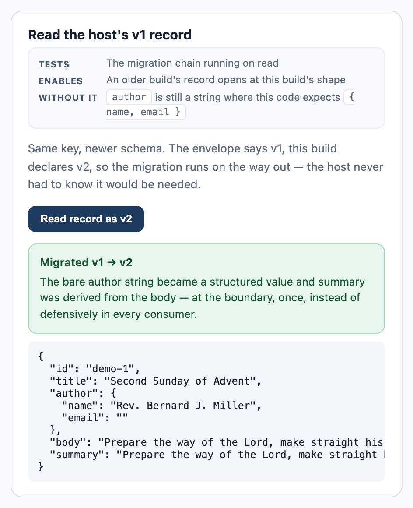

# Tutorial 3 — Versioned stores, the Angular way

**Package:** `@braidlabs/angular-core` · **Time:** ~20 minutes ·
**Prerequisites:** Tutorial 1, and an Angular 17+ app (the demo uses
standalone components, Signals, and `inject()`; no NgModules anywhere).

`@braidlabs/skew` is framework-free. This package is the thin, honest bridge to
Angular: a versioned store provided through DI, and a Signal wrapper that
reads it without flicker and without ever throwing at a component. You will
build a draft editor that survives a schema change *and* a reload — the demo's
remote editor, reduced to its essentials.

```sh
npm install @braidlabs/skew @braidlabs/angular-core
```

---

## Step 1 — The schema (from Tutorial 1)

Contracts live in one file, exported once, imported everywhere. If two parts
of your app declare the same contract separately, they *will* drift:

```ts
// src/app/domain.ts
import { versioned } from '@braidlabs/skew';

/** v1, frozen. Never edited again. */
interface DraftV1 {
  id: string;
  title: string;
  author: string;
  body: string;
}

export interface DraftV2 {
  id: string;
  title: string;
  author: { name: string; email: string };
  body: string;
  summary: string;
}

export const DraftSchema = versioned<DraftV1>('draft').next<DraftV2>(
  'structure the author and derive a summary',
  {
    up: (v1) => ({
      id: v1.id,
      title: v1.title,
      author: { name: v1.author, email: '' },
      body: v1.body,
      summary: v1.body.slice(0, 60),
    }),
    down: (v2) => ({
      id: v2.id,
      title: v2.title,
      author: v2.author.name,
      body: v2.body,
    }),
    derives: ['author.email', 'summary'],
    lossy: ['author.email', 'summary'],
  },
);

export const DRAFT_KEY = 'current';
```

---

## Step 2 — A token and a provider

A store is an injectable like any other — declared with a typed token,
provided once at the environment level:

```ts
// src/app/draft-store.ts
import { createSkewStoreToken } from '@braidlabs/angular-core';
import type { DraftV2 } from './domain';

export const DRAFT_STORE = createSkewStoreToken<DraftV2>('DRAFT_STORE');
```

```ts
// src/app/app.config.ts
import { ApplicationConfig } from '@angular/core';
import { webStorageDriver } from '@braidlabs/skew';
import { provideSkewStore } from '@braidlabs/angular-core';
import { DraftSchema } from './domain';
import { DRAFT_STORE } from './draft-store';
import { BUILD_ID } from '../generated/build-id';   // from Tutorial 2

export const appConfig: ApplicationConfig = {
  providers: [
    provideSkewStore(DRAFT_STORE, DraftSchema, {
      driver: webStorageDriver('local'),
      buildId: BUILD_ID,   // stamps envelopes, so a bad record names its writer
      onReadFailure: (key, failure) =>
        console.warn('[draft-store]', key, failure.reason, failure.message),
    }),
  ],
};
```

Why a token instead of injecting a concrete class: the token carries the
*payload type*, so every consumer gets a `VersionedStore<DraftV2>` without a
cast, and tests can provide the same token with a memory driver (step 5).

---

## Step 3 — Read it as a Signal

`injectSkewSignal` wraps one key of the store in three Signals plus two
verbs. The detail that separates it from a hand-rolled wrapper: it
synchronously **`peek()`s** the store first, so on `localStorage` the first
render already has data — no flash of empty state, no loading spinner for
sub-millisecond reads:

```ts
// src/app/draft-editor.ts
import { Component, inject } from '@angular/core';
import { injectSkewSignal } from '@braidlabs/angular-core';
import { DRAFT_STORE } from './draft-store';
import { DRAFT_KEY, type DraftV2 } from './domain';

@Component({
  selector: 'app-draft-editor',
  template: `
    @if (draft.loading()) {
      <p>Loading…</p>
    } @else if (draft.error(); as failure) {
      <div class="failure">
        <strong>Could not read the draft — {{ failure.reason }}</strong>
        @if (failure.reason === 'ahead') {
          <p>
            This draft was written by a newer deployment (v{{ failure.found }};
            this build understands v{{ failure.expected }}).
            The record is intact — it is this tab that is stale.
          </p>
          <button (click)="reloadApp()">Update this tab</button>
        } @else {
          <button (click)="draft.reload()">Try again</button>
        }
      </div>
    } @else if (draft.data(); as value) {
      <input
        [value]="value.title"
        (change)="rename(value, $any($event.target).value)"
      />
      <p>{{ value.author.name }} · {{ value.summary }}</p>
    } @else {
      <button (click)="create()">Start a draft</button>
    }
  `,
})
export class DraftEditor {
  protected readonly draft = injectSkewSignal(DRAFT_STORE, DRAFT_KEY);

  protected rename(current: DraftV2, title: string): void {
    // set() applies optimistically and persists through the schema —
    // the envelope, the version, the buildId all happen for free.
    void this.draft.set({ ...current, title });
  }

  protected create(): void {
    void this.draft.set({
      id: crypto.randomUUID(),
      title: 'Untitled',
      author: { name: 'You', email: '' },
      body: '',
      summary: '',
    });
  }

  protected reloadApp(): void {
    location.reload();
  }
}
```

What just happened, step by step:

1. On construction, the signal `peek()`ed synchronously. A v1 record written
   by *last month's build* migrated forward on the way out; the template
   never saw the old shape.
2. `draft.error()` is a typed `SkewErr | null` — the component branches on
   `reason` in the template, and the `ahead` branch gets its own honest UI
   instead of a generic "something went wrong".
3. `set()` updates the signal immediately and writes the envelope behind it.

This is the same pattern the demo's remote editor uses to read a record the
*host* build wrote — migrated at the boundary, once, instead of defensively
in every consumer:



---

## Step 4 — When you need the store itself

The signal covers one key. For imperative work — listing keys, deleting,
reading in an effect — inject the raw store through the same token:

```ts
import { injectSkewStore } from '@braidlabs/angular-core';

export class DraftAdmin {
  private readonly store = injectSkewStore(DRAFT_STORE);

  async discard(): Promise<void> {
    await this.store.remove(DRAFT_KEY);
  }

  async inspect(): Promise<void> {
    const result = await this.store.get(DRAFT_KEY);
    if (result.ok && result.migratedFrom) {
      console.log(
        `draft was written under v${result.migratedFrom}; ` +
          `guessed fields: ${result.derivedPaths.join(', ') || 'none'}`,
      );
    }
  }
}
```

Everything Tutorial 1 taught about results — `migratedFrom`,
`downgradedFrom`, `derivedPaths`, `lossyPaths` — flows through unchanged.
The Angular layer adds ergonomics, never semantics.

---

## Step 5 — Test with a memory driver

The token is the seam. Provide the same schema over `memoryDriver()` and the
whole component tree runs against an in-memory store — including the
migration path, which is the part worth testing:

```ts
import { TestBed } from '@angular/core/testing';
import { memoryDriver } from '@braidlabs/skew';
import { provideSkewStore } from '@braidlabs/angular-core';
import { DraftSchema, DRAFT_KEY } from './domain';
import { DRAFT_STORE } from './draft-store';

it('opens a v1 draft at the v2 shape', async () => {
  // Seed the driver with bytes exactly as an old build would have left them.
  const seed = new Map([
    [
      `draft:${DRAFT_KEY}`,
      JSON.stringify({
        v: 1,
        payload: { id: 'd1', title: 'T', author: 'Rev. Miller', body: 'B' },
      }),
    ],
  ]);

  TestBed.configureTestingModule({
    providers: [
      provideSkewStore(DRAFT_STORE, DraftSchema, { driver: memoryDriver(seed) }),
    ],
  });

  const store = TestBed.inject(DRAFT_STORE);
  const result = await store.get(DRAFT_KEY);

  expect(result.ok).toBe(true);
  if (result.ok) {
    expect(result.value.author).toEqual({ name: 'Rev. Miller', email: '' });
    expect(result.migratedFrom).toBe(1);
  }
});
```

Note what the seed is: the literal *bytes on disk*, envelope and all. Tests
that seed through `store.set()` only ever test the current version reading
itself — the case that never breaks.

---

## What you built

A draft editor that opens month-old records at today's shape, renders
failures as typed states instead of blank screens, never flickers on load,
and tests its own migration path against real stored bytes.

**Next:** [Tutorial 4 — One graph, durable writes](04-angular-data.md), for
the data that lives on a server instead of in a store.
