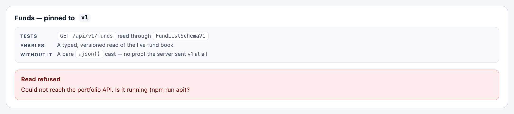

# Tutorial 6 — One graph, durable writes

**Package:** `@braidlabs/angular-data` · **Time:** ~30 minutes ·
**Prerequisites:** Tutorials 1 and 3. An Angular app with an HTTP API to talk
to — the samples below use the demo's portfolio API
(`npm run api`, port 3333), but any REST-ish backend works.

Angular's `resource()` and `httpResource()` are *per-call* caches: two
requests that return the same record produce two independent copies, and
updating one leaves the other stale. This package adds the three things every
data layer ends up reimplementing — **shared entity identity**, **tag
invalidation**, and **durable, optimistic writes** — with version skew
handled at every seam, because a queued write can outlive the deploy that
queued it.

```sh
npm install @braidlabs/skew @braidlabs/angular-data
```

---

## Step 1 — Turn it on

```ts
// src/app/app.config.ts
import { provideSkewData } from '@braidlabs/angular-data';
import { BUILD_ID } from '../generated/build-id';

export const appConfig: ApplicationConfig = {
  providers: [
    provideSkewData({
      owner: 'bulletin',     // this app's name in the shared outbox — required when persisting
      persistOutbox: true,   // queued writes survive a reload
      buildId: BUILD_ID,     // queued entries name the build that wrote them
      onOutboxError: (message, detail) => console.warn(message, detail),
    }),
  ],
};
```

Two behaviours start at bootstrap: the outbox **rehydrates and flushes
immediately** (work queued before the last reload should reach the server as
soon as this build runs, not on the next user action), and — by default — it
flushes again whenever the browser comes back `online`.

---

## Step 2 — Declare identity once

Deduplication requires knowing that two payloads describe the same thing,
which requires a declared identity. One declaration per type, exported,
agreed on by every query and mutation:

```ts
// src/app/portfolio/entities.ts
import { entity } from '@braidlabs/angular-data';

export interface Fund {
  id: string;
  name: string;
  currency: string;
  nav: number;
  cashPct: number;
}

export const FundEntity = entity<Fund>({ name: 'fund', key: (f) => f.id });
```

`tag` gives invalidation a shared vocabulary — a record, a type, or a named
view:

```ts
import { tag } from '@braidlabs/angular-data';

tag.entity(FundEntity, 'f1');  // 'fund#f1'   — one record
tag.all(FundEntity);           // 'fund#*'    — every fund
tag.collection('funds-page');  // 'funds-page' — an arbitrary view
```

---

## Step 3 — A query that feeds the graph

`query()` fetches, then **normalizes the response into the shared store**.
The response object itself is almost never what you render:

```ts
// src/app/portfolio/fund-list.ts
import { Component, inject } from '@angular/core';
import { HttpClient } from '@angular/common/http';
import { firstValueFrom } from 'rxjs';
import { EntityStore, query } from '@braidlabs/angular-data';
import { FundListSchemaV1 } from './contracts';   // Tutorial 2 habits apply
import { Fund, FundEntity } from './entities';

@Component({
  selector: 'app-fund-list',
  template: `
    @if (list.isLoading()) { <p>Loading…</p> }
    @for (fund of funds(); track fund.id) {
      <div>{{ fund.name }} — {{ fund.currency }} {{ fund.nav }}</div>
    }
  `,
})
export class FundList {
  private readonly http = inject(HttpClient);
  private readonly store = inject(EntityStore);

  protected readonly list = query({
    loader: async () => {
      const body = await firstValueFrom(this.http.get(`${API}/v1/funds`));
      const result = FundListSchemaV1.read(body);   // never `as Fund[]`
      if (!result.ok) throw new Error(result.message);
      return result.value;
    },
    normalize: FundEntity,          // every fund lands in the shared store
    tags: () => ['funds'],          // invalidating 'funds' re-runs this
  });

  // ✓ a live view of the shared graph
  protected readonly funds = this.store.selectAll(FundEntity);

  // ✗ this.list.value() — a private copy that drifts the moment
  //   anything else updates a fund
}
```

This is the part teams get wrong, so it bears repeating: **components read
from the store, not from the query.** If a component holds the parsed
response, writing an updated record into the store changes nothing that
component can observe, and normalization bought you exactly nothing.
`selectAll` and `select` return memoized Signals; `store.query(type, pred)`
gives you a filtered view.

The demo's fund list is exactly this shape — five funds, pinned to contract
v1, normalized into one graph that the drawer, the ticker strip, and the
breach feed all share:



Two behaviours you get without asking: out-of-order responses are discarded
(a slow earlier request can never overwrite a newer one), and a query with
`tags` re-runs automatically when any of its tags is invalidated.

---

## Step 4 — A mutation that can take a punch

`mutation()` is a write with the whole lifecycle declared in one place: the
optimistic overlay, rollback, invalidation, and (next step) durability:

```ts
import { mutation, tag } from '@braidlabs/angular-data';

readonly renameFund = mutation({
  operation: (input: { id: string; name: string }) =>
    firstValueFrom(this.http.patch(`${API}/v2/funds/${input.id}`, input)),

  // *Describes* the change. It appears in every read immediately, and if the
  // operation fails the description is dropped — there is nothing to roll
  // back, because the confirmed record was never touched.
  optimistic: (tx, input) => tx.patch(FundEntity, input.id, { name: input.name }),

  // Marked stale once the server agrees; the fund list's query re-runs.
  invalidates: (input) => [tag.entity(FundEntity, input.id), 'funds'],
});
```

```html
<button (click)="renameFund.mutate({ id: fund.id, name: draft })"
        [disabled]="renameFund.isPending()">
  Rename
</button>
```

Under the hood that callback runs against a transaction that **records** rather
than writes, and every read returns `confirmed ⊕ pending`:

```ts
readonly fund = this.store.select(FundEntity, id);              // includes the pending rename
readonly asServerSaid = this.store.peekConfirmed(FundEntity, id);
readonly disagreed = this.renameFund.conflict();                // { expected, actual, paths, entity }
```

The prediction is stored *with the queued entry*, which is why it survives a
reload and why another app on the page shows it too. And a rename the server
accepts but normalizes (`north star` → `North Star`) is neither a failure nor
something to swap in silently: `onConflict` defaults to `'raise'`, while the
record stored is the server's either way.

The [flow diagram](https://github.com/braidjs/braid/blob/main/libs/angular/data/README.md#the-whole-flow-end-to-end)
traces all of it — query, mutation, offline, reload, flush, invalidation — as
one numbered sequence.

`store.transaction()` still exists, for writes to the **confirmed** graph that
you want to unwind yourself:

```ts
const tx = store.transaction();
tx.apply((t) => {
  t.patch(FundEntity, 'f1', { cashPct: 5.0 });
  t.remove(OrderEntity, 'o9');
});
// …server says no…
tx.rollback();   // both records restored exactly
```

---

## Step 5 — Durability: the outbox

A write the user asked for should not evaporate because the tab closed or the
network dropped. `durability: 'outbox'` queues failed mutations durably and
replays them:

```ts
readonly submitOrder = mutation({
  id: 'portfolio.order.submit',     // REQUIRED for outbox — see below
  durability: 'outbox',
  schemaVersion: 2,                 // the contract this payload speaks
  operation: (order: OrderV2) => postOrder(order),
  optimistic: (tx, order) => tx.upsert(OrderEntity, toLocalOrder(order)),
  invalidates: () => ['orders'],
});
```

The rules that make it work, each there because of a real failure mode:

- **`id` is required and must be stable.** A queued entry outlives the
  closure that created it; after a reload it finds its operation again *by
  name*. Rename the id and orphan every queued write.
- **Register at bootstrap, not lazily.** Outbox mutations must be created
  during app construction (a root service, an `ENVIRONMENT_INITIALIZER`) so a
  queue rehydrated at start-up has somewhere to go.
- **On failure, the optimistic state stays.** From the user's point of view
  the change happened; it reaches the server when connectivity returns. This
  is the opposite of the memory-durability path, which rolls back — choose
  per mutation.
- **`schemaVersion` travels with the entry.** This is Tutorial 2 aimed at the
  write path: an order queued today may flush against next week's API.

That last point deserves its own step.

---

## Step 6 — When a queued write meets a newer server

The outbox re-runs a failed entry with the *same input* on its next flush —
so if the server now refuses that input's contract version, retrying at the
library level would resend the same stale payload forever. The migration has
to happen **inside the runner**, before it returns. This is the demo's
order-submission path, verbatim in spirit:

```ts
async function runOrderMutation(input: unknown, entry: OutboxEntry) {
  const envelope =
    entry.schemaVersion === 2
      ? OrderSchemaV2.write(input as OrderV2)
      : { v: entry.schemaVersion, payload: input };

  const first = await postOrder(envelope);
  if (first.status !== 409) return first.body;

  // The server refused for version skew. Migrate the queued payload with
  // OUR chain and retry once — seeded by the entry id, so the derived
  // idempotency key is identical on every retry.
  const migrated = OrderSchemaV2.read(envelope, {
    context: { now: () => new Date(), seed: entry.id },
  });
  if (!migrated.ok) throw new Error(`cannot migrate queued order: ${migrated.reason}`);

  const retry = await postOrder(OrderSchemaV2.write(migrated.value));
  if (!retry.ok) throw new Error(`retry rejected: HTTP ${retry.status}`);
  return retry.body;
}
```

The `seed: entry.id` line is small and load-bearing: an idempotency key
derived from the clock mints a *new* identity on every retry — the one
property an idempotency key must not have. The entry's stable id makes the
migrated payload identical across attempts, so the server can deduplicate.

You can watch this whole path run in the demo: open a fund on the Portfolio
tab, use **"queue as v1"** on the order form, and follow the trace — queued,
refused with `409 version-skew`, migrated, accepted.

---

## What you built

One shared graph that every view reads from; queries that normalize into it
and re-run by tag; writes that apply instantly, roll back precisely, survive
reloads, and migrate themselves when the server has moved on since they were
queued.

**Where next:** the [README](https://github.com/braidjs/braid/blob/main/README.md)'s production demo ties all four
tutorials into one running system — and its Basics walkthrough is the
fastest way to *see* every claim these tutorials made.
