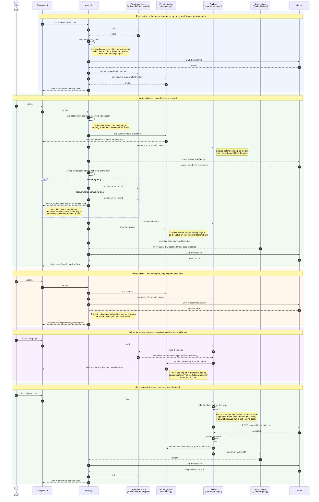

# @skewkit/angular-data

Normalized entity store, tag-based invalidation, and a **durable mutation outbox** for Angular.

Signals throughout. Zoneless-safe. No NgModules.

---

## Why this exists

Angular's `resource()` / `httpResource()` are good _reads_, but they are per-call caches:

```ts
const list = httpResource(() => '/api/bulletins'); // Bulletin[]
const one = httpResource(() => `/api/bulletins/${id()}`); // Bulletin
```

These share no identity. Updating `one` leaves the matching row inside `list` stale, and there is no integration point that lets a third-party store observe what either fetched. There is also **no write primitive at all** — no optimistic update, no rollback, and nothing that survives a reload.

This package supplies the missing half.

---

## Setup

```ts
provideSkewData({
  owner: 'bulletin', // this app's name in the shared outbox — required when persisting
  persistOutbox: true, // queued writes survive a reload
  buildId: BUILD_ID, // from @skewkit/build
  onOutboxError: (message, detail) => telemetry.error(message, detail),
});
```

`owner` is required whenever the outbox persists, and is not defaulted on purpose. The outbox is
stored per **origin**, not per application, so several apps on one page share it — ownership is what
stops one from replaying or discarding another's queued mutations. A default would put every app
under the same name, which is exactly the collision it exists to prevent, and it would fail silently
on someone's unsent work.

Queued entries are stored one record per entry, so appending never reads the queue first and two
apps cannot lose each other's writes.

---

## Identity first

```ts
export const Bulletin = entity<Bulletin>({ name: 'bulletin', key: (b) => b.id });
```

Declare each type once and export it. Identity is only useful if every query and mutation agrees on it.

## Reading

```ts
readonly bulletins = query({
  loader: () => firstValueFrom(this.http.get<Bulletin[]>('/api/bulletins')),
  normalize: Bulletin,
  tags: () => ['bulletins'],
});

// Read through the store — NOT through bulletins.value()
readonly rows      = this.store.selectAll(Bulletin);
readonly published = this.store.query(Bulletin, (b) => b.status === 'published');
readonly current   = this.store.select(Bulletin, this.id);
```

> **The mistake to avoid.** If a component holds `bulletins.value()`, it owns a private copy. Writing an updated record into the store changes nothing it can observe, and normalization buys you exactly nothing. Read through `select` / `selectAll` / `query`.

`normalize` handles the shapes real APIs return — a bare record, an array, or an envelope like `{ items: [...] }`. Anything unrecognised is left alone rather than guessed at.

## Writing

```ts
readonly publish = mutation({
  id: 'bulletin.publish',
  operation: (b: Bulletin) => firstValueFrom(this.http.post(`/api/bulletins/${b.id}/publish`, b)),
  optimistic: (tx, b) => tx.patch(Bulletin, b.id, { status: 'published' }),
  invalidates: (b) => [tag.entity(Bulletin, b.id), 'bulletins'],
  durability: 'outbox',
  schemaVersion: 41,
});

await this.publish.mutate(bulletin);
```

### The optimistic view is derived, never stored

```
view(record) = confirmed(record) ⊕ pending(record)
```

`optimistic` **describes** the change; it does not apply it. The description is queued, and every read through `select` / `selectAll` / `peek` returns the confirmed record with the queue's predictions on top. Three things fall out of that, none of them available to a design that patches the store and keeps an undo log:

- **Rollback is deletion.** A failed mutation's entry is dropped and the view recomputes. There is no undo record to keep in agreement with anything.
- **It survives a reload.** The prediction lives in the same storage as the queue, so a user who queues an edit offline and refreshes still sees their edit — not the value they replaced, with their change invisibly waiting to send.
- **Every app on the page sees it.** The queue is shared per origin, so one app showing another's unsent edit is a property of where the overlay lives rather than of any coordination between them.

`peekConfirmed` is the escape hatch for when you specifically want the server's last word.

### When the server disagrees

```ts
readonly publish = mutation({
  // …
  onConflict: 'raise', // default │ 'accept' │ (conflict) => valueToStore
});

this.publish.conflict(); // Signal<MutationConflict | null>
this.publish.hasPendingWrite(); // Signal<boolean>
```

A server that accepts a write and stores something else — trimmed, title-cased, resolved against a rule the client does not know — has not failed. `'raise'` reports it as `{ expected, actual, paths, entity }` so the UI can say so. The stored record becomes the server's value regardless, because you cannot make a server hold your value without another mutation; the only question is whether the user is told, and silence is opted into per mutation by a team that knows the field is server-authoritative.

A conflict is only reported when the response *is* the record. An operation resolving with `void`, an id, or a receipt has not contradicted anything.

---

## The outbox

The piece that cannot be built with in-flight request machinery. A mutation queued while offline has to survive a page reload — and after a reload there is no pending `Promise` to retry, no `HttpRequest` to intercept, and no closure left alive. Only something persisted can be replayed.

Which forces one API constraint:

```ts
mutation({ durability: 'outbox' })            // ✗ throws
mutation({ id: 'bulletin.publish', … })       // ✓ replayed by id
```

Operations are closures and closures don't serialise, so a queued entry finds its operation again by **id**. This also means outbox mutations must be created during bootstrap rather than lazily inside a click handler — a queue rehydrated at start-up needs somewhere to go.

**Behaviour worth knowing:**

- **Strictly sequential.** Entries frequently depend on each other (create a thing, then publish it); parallel flushing would race them. A failure stops the drain rather than skipping ahead.
- **Optimistic state is kept on queue.** From the user's point of view the change happened; it reaches the server when the network returns. It is kept by being *derived from* the queue, so the two cannot disagree — see the overlay above.
- **Permanently-failing entries are dropped, loudly.** After `maxOutboxAttempts` the entry is abandoned and reported through `onOutboxError` — never silently, because the user already navigated away believing it saved.
- **A queue written by a newer build is left untouched.** Replaying it would send payloads this build doesn't understand. `@skewkit/core` surfaces that as `ahead` rather than discarding the user's work.

```ts
const outbox = inject(OutboxService);
outbox.pendingCount(); // Signal<number>
outbox.hasPendingWork(); // Signal<boolean>  → "3 changes waiting to sync"
outbox.isFlushing();
```

---

## The whole flow, end to end

One read, one write, and the same write again with the network gone. Every arrow below is a real
call in this library — the numbering is there so the prose elsewhere in this README can point at a
step. Tags are written `bulletin/42` here only because `#` is awkward inside a Mermaid label; in
code they are `bulletin#42`.



Three properties of that picture are worth stating on their own, because each is a bug the obvious
design ships with:

- **The overlay is never written to the confirmed store.** Settling a write is removing its entry
  and re-deriving (steps 23–24, and again at 48–49 when the flush sends it) — so a *failed* write
  needs no separate path, and there is no undo log to keep in agreement with a record that moved
  underneath it.
- **The queue is the overlay.** They are one set of records, so they cannot drift apart — the
  reload above works for the same reason the offline write does.
- **Both halves are shared per origin.** Another app on the page reads the same confirmed store and
  the same queue, so it shows the pending edit too, and its own queued work is left alone rather
  than replayed by whoever happens to flush.

---

## Invalidation

Tags, not TTLs. A time-to-live is a guess about when data went stale; a mutation _knows_.

```ts
tag.entity(Bulletin, '42'); // 'bulletin#42'
tag.all(Bulletin); // 'bulletin#*'  — matches every bulletin#…
tag.collection('bulletins'); // 'bulletins'

inject(CacheRegistry).invalidate('bulletins');
```

Tags are supplied as a getter and re-read on each invalidation, so a query whose tags depend on signals (a route param, a filter) stays correct without re-subscribing. A subscriber that throws is isolated — one bad query can't stop the others refreshing.

---

## API

| Export                                      | Purpose                                                                                   |
| ------------------------------------------- | ----------------------------------------------------------------------------------------- |
| `entity<T>({ name, key })`                  | Declare identity                                                                          |
| `tag.entity` / `tag.all` / `tag.collection` | Build invalidation tags                                                                   |
| `EntityStore`                               | `select` · `selectAll` · `query` · `peek` · `peekConfirmed` · `upsert` · `patch` · `remove` · `transaction` |
| `query(config)`                             | Read + normalize + subscribe to tags                                                      |
| `mutation(config)`                          | Write + optimistic overlay + conflict reporting + durability                              |
| `PendingWrites`                             | `overlays` · `hasPending` — the pending half of every read                                 |
| `OutboxService`                             | `entries` · `pendingCount` · `flush` · `remove` · `clear`                                 |
| `CacheRegistry`                             | `invalidate` · `subscribe`                                                                |
| `provideSkewData(options)`                  | Wire it up                                                                                |

---

## Known gaps

- **`resource()` can't normalize into this store**, so `query()` is a parallel primitive rather than an extension. Documented duplication we'd happily delete if Angular grew the hook.
- **Server-driven invalidation isn't shipped yet.** Tags currently work per-tab. The wire contract (`{ invalidate: string[] }` over SSE) is designed in planning.
